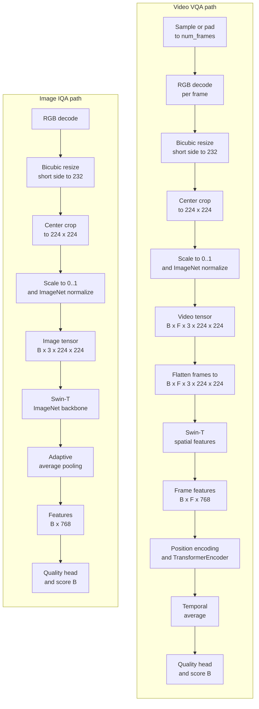

# deep-vqa-framework

[](https://www.python.org/)
[](https://pytorch.org/)
[](https://github.com/autentisitet/deep-vqa-framework/releases)
[](https://opensource.org/licenses/MIT)
<<<<<<< HEAD
[](https://github.com/autentisitet/deep-vqa-framework)
=======
[](https://github.com/autentisitet/deep-vqa-framework)
>>>>>>> origin/main
[](https://github.com/autentisitet/deep-vqa-framework)
[](https://github.com/autentisitet/deep-vqa-framework)

**🌐 [English](README.md) | [简体中文](README_zh.md)**

**An end-to-end platform for image and video quality assessment.**

Deep-VQA-Framework provides the engineering path from quality-labeled media to a usable IQA/VQA model: dataset inspection and integrity checks, leakage-aware splitting, reproducible training and evaluation, experiment artifacts, checkpoint selection, batch inference, and containerized API deployment. It is designed as an extensible platform for developing and operating image/video quality assessment models, rather than as a single model implementation.

### Product scope

The core product is a no-reference image/video quality assessment framework and
inference API. Its capabilities are layered:

- **Core:** dataset workflows, IQA/VQA training, evaluation, checkpoints, and inference.
- **Deployment:** FastAPI, Docker/Podman, and a single-instance internal workbench or protected stateless API.
- **Frontend:** one shared browser workspace for upload, scoring, history, and model interpretation.
- **Optional extension:** Ollama-based technical quality descriptions and auxiliary subjective scores for development and rapid validation.

The internal deployment is a single-instance workbench, not a multi-tenant SaaS
account system. The API key is deployment-level access control, not a user
identity or role-management system. Public deployments should use the stateless
store backend and an API gateway or equivalent protection. Ollama is optional
and does not replace the framework's IQA/VQA models.

Out of scope are multi-tenant account management, general-purpose media
storage, and a hosted SaaS control plane. See the [deployment knowledge](knowledge/deployment.md)
and [frontend knowledge](knowledge/frontend.md) for supported operating modes.

### Deployment boundary

The supported baseline is a single-instance service, typically split across
two hosts: an edge Nginx/static-frontend host and a FastAPI/model host. SQLite,
when enabled, stays on the FastAPI host's local disk; it is not a network
database and must not be shared by multiple API hosts. Ollama may run on a
separate private host.

Enterprise TLS/WAF/API gateways, identity providers, multi-tenant authorization,
and server databases are intentionally outside this project's implementation
scope. They may surround the service when an organization requires them, but
are not planned features of Deep-VQA-Framework. The documented API key is a
bootstrap/service token for trusted single-instance deployments, not a user
identity system.

The current default model uses a Swin-T backbone for image and per-frame spatial features. Video assessment adds positional encoding and Transformer-based temporal fusion. After training, selected checkpoints can be handed off to `deploy/` for batch or API inference.

Media extensions are classified centrally. JPG/PNG/WEBP and common MP4/MOV/MKV
formats are the default training/serving contract; HEIC, AVIF, GIF and
professional video containers are recognized as experimental only. Extensions
are not trusted as file identity: OpenCV/Decord must successfully decode the
content, so a file with a forged suffix is rejected during processing.

---

## Table of Contents

- [Architecture & Design Decisions](#architecture-decisions)
- [Model Architecture](#model-architecture)
- [Training Pipeline](#training-pipeline)
- [Evaluation & Metrics](#evaluation-metrics)
- [Deployment & Inference API](#deployment-api)
<<<<<<< HEAD
- [Developer Knowledge Base](knowledge/README.md)
- [Deployment Guide](knowledge/deployment.md)
- [Frontend Guide](knowledge/frontend.md)
- [Ollama Guide](knowledge/ollama.md#ollama-integration-guide)
=======
- [Deployment Guide](deploy/GUIDE.md)
>>>>>>> origin/main
- [Frontend](frontend/index.html)
- [Project Main Structure](#project-main-structure)
- [Docker / Podman Support](#docker-support)
- [System Overview](#system-overview)
- [Configuration Guide](#configuration-guide)
- [Troubleshooting](#troubleshooting)
- [Dependency Security](#dependency-security)
- [License](#license)
- [Security Policy](SECURITY.md)
- [Acknowledgements](#acknowledgments)
- [References](#references)

---

## Architecture & Design Decisions <a id="architecture-decisions"></a>

### Design Contracts

The platform is organized around explicit contracts for data, models, configuration, evaluation, and deployment. This keeps the training and serving paths reproducible as new datasets and model variants are added.

| Contract | Implementation |
| :--- | :--- |
| **Modality routing** | 4D tensors are image batches, 5D tensors are video batches; invalid channel layouts fail early |
| **Backbone policy** | The image backbone is selected by the model configuration (Swin-T by default; ResNet50 supported); video reuses its spatial backbone with positional encoding and temporal fusion |
| **Preprocessing** | Images and sampled video frames use RGB, bicubic resize 232, center crop 224, and ImageNet mean/std normalization |
| **Data rejection** | Missing/corrupted media is removed before EDA and splitting; labels are backed up instead of rewritten to zero |
| **Split isolation** | Train/val/test and K-fold splits are group-aware to keep repeated reference content in one partition |
| **Artifacts** | Outputs use lowercase dataset keys under `results/{dataset}/`; successful runs publish `{dataset}_best.pt` into `deploy/` |
| **Runtime config** | Training and serving use typed Pydantic configuration with centralized path resolution |

---

## Model Architecture <a id="model-architecture"></a>

### IQAVQANet: Unified Quality Assessment Network



### Supported Configurations

| Input | Tensor Shape | Backbone | Normalization |
| :--- | :--- | :--- | :--- |
| Image | `[B, 3, H, W]` | Configured ImageNet backbone (Swin-T default; ResNet50 supported) | RGB, bicubic resize 232, center crop 224, ImageNet mean/std |
| Video | `[B, F, 3, H, W]` | Swin-T ImageNet backbone (`LayerNorm`) + Transformer temporal fusion | RGB frames, bicubic resize 232, center crop 224, `[0, 1]`, ImageNet mean/std |

The current codebase expects checkpoints produced by the current `IQAVQANet` implementation. This repository does not contain a `v0.7.3` tag, so historical claims against that version are intentionally not made here.

### Loss Function: Task-Aware Hybrid Loss

`IQAVQALoss` combines robust MOS regression with pairwise ordering:

```text
Total Loss = w_huber × SmoothL1 + w_rank × PairwiseLogisticRank
```

| Task | SmoothL1 | Rank |
| :--- | :------- | :--- |
| IQA (`swin_iqa`) | 0.7 | 0.3 |
| VQA (`swin_vqa`) | 0.7 | 0.3 |

- **SmoothL1/Huber Loss**: Preserves MOS regression accuracy while reducing sensitivity to subjective-label outliers
- **Pairwise Logistic Rank Loss**: Optimizes pairwise ordering and ignores unreliable pairs below `rank_epsilon`

---

## Training Pipeline <a id="training-pipeline"></a>

### Quick Start Training

#### Step 1: Environment Setup

```bash
# Initialize environment and install dependencies
make install DEV=1

# Check environment status
make info

# Download datasets, unrar and make symbol links
make data
```

#### Step 2: Training Commands

Run training directly with uv:

```bash
# TID2013 (Image Quality Assessment)
uv run python -m src.main --model swin_iqa --dataset tid2013

# KoNViD-1k (Video Quality Assessment)
uv run python -m src.main --model swin_vqa --dataset konvid-1k

# T2VQA-DB (Text-to-Video Quality Assessment)
uv run python -m src.main --model swin_vqa --dataset t2vqa-db
```

> Dataset note: TID2013 is a full-reference image quality assessment (FR-IQA) dataset, where each distorted image has a corresponding pristine reference image. KoNViD-1k is a no-reference video quality assessment (NR-VQA) dataset. The current TID2013 training/inference entry point reads only distorted images and MOS labels and does not pass reference images to the model, so it runs as a single-image IQA pipeline.

The training entry point runs the pipeline in this order:

```text
integrity check -> EDA/statistics -> group-aware train/val/test split -> group-aware K-fold training with ImageNet preprocessing -> plots -> checkpoint deployment
```

*Note: By default, DEBUG=0 is applied in make commands. You can override it by appending DEBUG=1 if needed.*

> [!NOTE]
> The default IQA configuration is `swin_iqa` (image/Swin-T). `resnet_iqa` remains an optional ResNet50 fallback, while `swin_vqa` uses Swin-T plus Transformer temporal fusion. Model configs are loaded from `train-config/models/*.yaml` by file name.

> [!NOTE]
> `scripts/setup_env.sh` also installs and verifies `hatchling`, so `deploy/` can be built from `pyproject.toml` without extra manual setup.

> [!WARNING]
> `--skip_integrity` skips media decoding checks and is intended only for fast debugging. Normal training should keep integrity checks enabled so corrupted/missing samples cannot enter cross-validation.

---

## Evaluation & Metrics <a id="evaluation-metrics"></a>

### Core Metrics

| Metric | Full Name | Interpretation |
| :--- | :--- | :--- |
| **PLCC** | Pearson Linear Correlation Coefficient | Linear relationship (accuracy) |
| **SROCC** | Spearman Rank Order Correlation Coefficient | Monotonic relationship (ranking) |
| **KROCC** | Kendall Rank Correlation Coefficient | Ordinal agreement |
| **RMSE** | Root Mean Square Error | Prediction error magnitude |
| **R²** | Coefficient of Determination | Variance explained |

### Visualizations

The framework automatically generates:

- **EDA Distribution**: MOS histogram and boxplot
- **Training History**: Loss, PLCC/SROCC/KROCC, RMSE/R² and available training metrics
- **Residual Diagnostics**: Residual vs predicted MOS, residual vs true MOS, true-vs-predicted scatter and error distribution
- **MOS-bin Analysis**: Mean absolute error grouped by true MOS intervals
- **Fold Summary/Comparison**: Per-fold PLCC/SROCC/RMSE/R² summaries, stability views and comparison bars
- **Sample-level Error Reports**: Complete prediction manifests and automatically exported top-k error samples
- **Feature Interpretability**: Backbone feature grids and regression Grad-CAM overlays for image inputs
<<<<<<< HEAD
- **Subjective Quality Assessment**: Optional Ollama vision-model description, score, and Bayesian posterior for the current frontend request

The browser frontend is intentionally focused on media upload, no-reference IQA/VQA inference, model output, and interpretability. For distribution analysis, use an offline feature-artifact workflow: extract embeddings for every training sample, fit PCA once on the training split, save the projection and normalization parameters, then project a problem sample into that same space for comparison.

The optional subjective assessment uses Ollama and `deploy-config/ollama/Modelfile`. It samples
one image or a small number of video frames, requests a technical quality
description and a 0–100 score from the local vision model, then applies a neutral
Beta prior to produce a Bayesian posterior score and approximate 95% interval.
These results are ephemeral and are not written to SQLite or JSONL history.

```bash
make env-secrets
make docker-infer-internal-ollama  # internal profile with optional Ollama
# Unified health check:
make docker-deploy-check
make docker-stop
```

`make docker-infer` selects the deployment profile through `DEPLOYMENT_MODE`
(`internal` by default) and does not start Ollama. The corresponding `*-ollama` targets start
the optional Ollama container and initialize
the `qwen2.5vl:3b` model.

The Ollama Compose file mounts `Modelfile`. The `*-ollama` Make target runs a
short-lived task from the `vqa-ollama` image that pulls `qwen2.5vl:3b` and
creates `deep-vqa-subjective`; mounting the file by itself does not create a
model or a second long-lived service.

See the [Ollama guide](knowledge/ollama.md) for host and container configuration.

This keeps the trained no-reference IQA/VQA models as the core capability while making dataset coverage and outlier analysis reproducible. The saved artifact should include the feature extractor/checkpoint identifier, dataset split, sample IDs, feature normalization parameters, PCA components/mean, and 2-D coordinates.

The workflow is implemented in `src/data/eda/feature_distribution.py`:

```bash
# Fit the training distribution (use the train split only)
uv run python -m src.data.eda.feature_distribution build \
  --checkpoint deploy/vqa-models/konvid-1k_best.pt \
  --dataset konvid-1k

=======

The browser frontend is intentionally focused on media upload, no-reference IQA/VQA inference, model output, and interpretability. For distribution analysis, use an offline feature-artifact workflow: extract embeddings for every training sample, fit PCA once on the training split, save the projection and normalization parameters, then project a problem sample into that same space for comparison.

This keeps the trained no-reference IQA/VQA models as the core capability while making dataset coverage and outlier analysis reproducible. The saved artifact should include the feature extractor/checkpoint identifier, dataset split, sample IDs, feature normalization parameters, PCA components/mean, and 2-D coordinates.

The workflow is implemented in `src/data/eda/feature_distribution.py`:

```bash
# Fit the training distribution (use the train split only)
uv run python -m src.data.eda.feature_distribution build \
  --checkpoint deploy/vqa-models/konvid-1k_best.pt \
  --dataset konvid-1k

>>>>>>> origin/main
# Project new/problem samples into the saved space
uv run python -m src.data.eda.feature_distribution project \
  --artifact results/konvid-1k/eda/feature_distribution/train_pca.npz \
  --checkpoint deploy/vqa-models/konvid-1k_best.pt \
  --input path/to/problem.mp4 \
  --output results/konvid-1k/eda/feature_distribution/problem_projection.json
```

The build command saves the compressed feature/PCA artifact, metadata JSON, and
training scatter plot. The project command reports PCA coordinates, nearest
training sample, and an empirical nearest-distance percentile, together with a
query scatter plot. The model embedding is produced by the same
`IQAVQANet.extract_quality_features()` path used by inference.

See the Project Structure section below for the complete artifact and directory layout.

---

## Deployment & Inference API <a id="deployment-api"></a>

For the complete deployment matrix, authentication, storage modes, Ollama variants, API routes, batch CLI, and troubleshooting, see the [Deployment Guide](knowledge/deployment.md). This section keeps only project-level entry points.

Training publishes the selected checkpoint to one of these task-specific locations:

```text
deploy/iqa-models/{dataset}_best.pt
deploy/vqa-models/{dataset}_best.pt
```

The checkpoint contains the model configuration and MOS range required by the
deployment loader. The API uses the task roles `iqa` and `vqa`; the actual
backbone is read from the loaded checkpoint.
Checkpoint usage and release restrictions are covered by the project disclaimer; review
[DISCLAIMER.md](DISCLAIMER.md) before redistribution.

### FastAPI Service

<<<<<<< HEAD
See the dedicated [deployment guide](knowledge/deployment.md) for host mode, Docker/Podman
=======
See the dedicated [deployment guide](deploy/GUIDE.md) for host mode, Docker/Podman
>>>>>>> origin/main
startup, API routes, batch CLI, proxy handling, SELinux mounts, and troubleshooting.

```bash
uv run python -m uvicorn deploy.api:app --host 127.0.0.1 --port 8000
```

For containerized deployment, `make docker-infer` starts FastAPI and Nginx.
Nginx serves `frontend/` on host port `8000` and proxies `/api/v1/*`; set
`WEB_PORT=80` to use port 80. Direct development with a
separate frontend origin requires `CORS_ALLOW_ORIGINS`.

FastAPI generates OpenAPI documentation automatically:

```text
Swagger UI: http://localhost:8000/api/docs
ReDoc:      http://localhost:8000/api/redoc
OpenAPI:    http://localhost:8000/api/openapi.json
```

The main REST resources are `GET /api/v1/health`, `GET /api/v1/models`,
<<<<<<< HEAD
`GET /api/v1/models/{model_id}`, `GET /api/v1/frontend-evaluations`,
`POST /api/v1/evaluations?model_id=iqa`, and the ephemeral
`POST /api/v1/subjective-assessments`.
=======
`GET /api/v1/models/{model_id}`, and `POST /api/v1/evaluations?model_id=iqa`.
>>>>>>> origin/main
The evaluation endpoint accepts one multipart `file` and returns a typed
evaluation resource.

On startup, the service also writes the generated schema to
`docs/openapi.json` for offline inspection and version control.
The production compose service mounts the host `docs/` directory so this file
persists after the container is recreated.

When running FastAPI directly without Nginx, use `/docs`, `/redoc`, and
`/openapi.json` instead of the `/api/...` proxy paths shown above.

At startup, the service loads available IQA/VQA checkpoints. `/api/v1/health`
reports loaded tasks and device; startup fails if no checkpoint is available.

### Batch Inference

```bash
uv run python -m deploy.cli -i examples/images/
uv run python -m deploy.cli -i examples/videos/
uv run python -m deploy.cli -i examples/

# Optional image feature-map and Grad-CAM visualization
uv run python -m deploy.cli -i examples/images/sample.jpg --visualize
```

Visualization artifacts remain durable under `reports/iqa-test/`. The browser
shows a reduced source thumbnail beside the generated feature maps and
Grad-CAM; double-click any comparison image to open the large preview.

The CLI selects the task-specific checkpoint, detects image/video files, and
writes JSON reports to `reports/iqa-test/` or `reports/vqa-test/`. The Make
targets `test-images`, `test-videos`, and `test-all` call this CLI. MOS bounds
<<<<<<< HEAD
are loaded from `train-config/dataset_config.yaml` using the dataset stored in the
=======
are loaded from `config/dataset_config.yaml` using the dataset stored in the
>>>>>>> origin/main
checkpoint configuration.

---

## Project Main Structure <a id="project-main-structure"></a>

```text
deep-vqa-framework/
├── Makefile                # Automation & workflow commands
├── README.md               # Project overview
├── DISCLAIMER.md           # Legal liability & resource usage policy
├── pyproject.toml          # Dependency, environment & build management (uv + hatchling)
│
├── train-config/           # Training defaults, dataset metadata, model YAML
│   ├── basic.yaml            # System and training defaults
│   ├── dataset_config.yaml   # Dataset-specific metadata
│   └── models/               # Model architecture parameters
│
├── datasets/                 # Data storage & symlink routing
│   ├── KoNViD-1k/               # Video quality dataset
│   ├── T2VQA-DB/                 # Text-to-Video QA dataset
│   └── TID2013/                  # Image quality dataset
│
├── docs/                     # Interactive architecture & manuals
│   └── openapi.json             # Generated API schema
|
├── reports/                  # Inference artifacts plus security reports
│   ├── iqa-test/                # IQA JSON and feature-map/Grad-CAM reports
│   └── vqa-test/                # VQA batch-inference JSON reports
|
├── results/
│   ├── diagnostics/             # Feature maps and Grad-CAM outputs
|   ├── {dataset}/
│   │   ├── train_logs/           # Training history, CSV logs
│   │   ├── plots/                # Loss curves, residual plots
│   │   ├── analysis/             # Error diagnostics and grouped metrics
│   │   │   └── errors/           # Top-error samples and MOS-bin summaries
│   │   ├── eda/                  # Dataset analysis plots
│   │   ├── model_outputs/        # Checkpoints (.pt files)
│   │   └── corrupted/            # Quarantined corrupt media + rejected label backups
│   └── scripts_logs/             # Shell script logs (setup, data, etc.)
|
├── deploy-config/            # Deployment profiles, Compose, Nginx, Ollama
│   ├── profiles/               # Internal/public serving policy
│   ├── compose/                # Base + Docker/Podman overlays
│   ├── nginx/                  # Reverse-proxy configuration
│   └── ollama/                 # Optional Ollama compose + Modelfile
│
├── .github/workflows/        # CI/CD pipelines
│   └── ci.yaml                 # Continuous Integration
|
├── scripts/                  # Infrastructure automation
│   ├── bootstrap.sh             # System-level initialization (apt, mirrors, system tools)
│   ├── setup_env.sh             # Project-level initialization (uv, .venv, Python deps, hatchling install/verification)
│   ├── manage_data.sh           # Download & data preparation
│   ├── archive_results.sh       # Package results
│   ├── cache_clean.sh           # Cache cleanup
│   └── ci_test_extract.sh       # CI helper for smart_extract test
│
├── deploy/                  # Standalone inference service and batch CLI (decoupled from training)
│   ├── api.py                    # FastAPI service
│   ├── cli.py                    # Batch inference CLI
│   ├── core/                     # Runtime config, preprocessing, loading, inference helpers
│   ├── iqa-models/               # IQA .pt checkpoints served by api.py
│   └── vqa-models/               # VQA .pt checkpoints served by api.py
│
├── frontend/                # Static browser UI for model inference
│   ├── index.html                 # Upload, inference and interpretation UI
<<<<<<< HEAD
=======
│   └── index.html                 # Upload, inference and interpretation UI
>>>>>>> origin/main
│
└── src/                       # Core framework logic
    ├── main.py                   # Global execution entry point
    ├── data/                        # Data loaders, preprocessing, EDA & integrity analysis
    │   └── eda/feature_distribution.py # Training embedding/PCA artifacts and projection CLI
    ├── core/                        # Training engine & evaluation pipeline
    ├── models/                      # Backbones, heads, losses, metrics, and IQAVQANet
    ├── utils/                        # Configuration, logging & path management
    ├── config/                     # Pydantic config system (code)
    └── visualization/              # Training plots and feature/Grad-CAM visualization
```

---

## Docker / Podman Support <a id="docker-support"></a>

<<<<<<< HEAD
For the complete deployment workflow and internal/public mode matrix, see the [Deployment Guide](knowledge/deployment.md). Frontend login, history, stateless behavior, and accessibility notes are in the [Frontend Guide](knowledge/frontend.md).
=======
For the complete deployment workflow, see [deploy/GUIDE.md](deploy/GUIDE.md).
>>>>>>> origin/main

The framework supports containerized development and deployment with both Docker and Podman.

### Quick Start with Docker

```bash
# Build and enter development container
make docker-dev

# Run training in container
make docker-train

# Create internal-mode secrets once (safe to rerun)
make env-secrets

# Start inference API service
make docker-infer

# Stop all containers
make docker-stop

# Batch inference on example images
make test-images

# Batch inference on example videos
make test-videos

# Batch inference on all examples
make test-all

# Remove containers, images, volumes, and networks
make docker-purge-all

# Check container environment
make docker-manage
```

### Container Configuration

| Component | Description |
| :--- | :--- |
<<<<<<< HEAD
| `Dockerfile` | Multi-stage builds: `base` (shared deps), `dev` (mounted development shell), `train` (training), `prod` (inference) |
| `deploy-config/compose/docker-compose.yaml` | Base services, bridge network, ports, mounts, and health checks |
| `deploy-config/compose/docker-compose.docker.yaml` | Docker-specific NVIDIA runtime settings |
| `deploy-config/compose/docker-compose.podman.yaml` | Podman GPU devices, SELinux options, and mount labels |
=======
| `Dockerfile` | Multi-stage builds: `base` (shared deps), `train` (training), `prod` (inference) |
| `docker-compose.yaml` | Main compose configuration with API health checks, json-file log rotation, model/report/cache mounts, and persistent OpenAPI output |
| `docker-compose.docker.yaml` | Docker-specific GPU support plus host-network builds |
| `docker-compose.podman.yaml` | Podman-specific GPU support plus host-network builds |
>>>>>>> origin/main

The Makefile auto-detects Docker vs Podman. For Podman users, `make docker-*` does not require `alias docker=podman`; aliases are only useful if you run container commands manually.

Use `make help` for the command index and `make help-TARGET` for focused guidance, for example `make help-docker-infer` or `make help-docker-purge-all`. Podman is supported on both SELinux and non-SELinux distributions; the Podman overlay applies `:Z` labels for SELinux hosts while remaining usable on Ubuntu and other distributions.

Choose the runtime mode that fits the workflow:

```bash
<<<<<<< HEAD
make docker-infer              # Full API + Nginx + frontend; defaults to internal policy
# For stateless/public policy:
make docker-infer DEPLOYMENT_MODE=public
=======
make docker-api       # API-only development mode on http://127.0.0.1:8001
make docker-infer     # Full API + Nginx + frontend mode with automatic verification
>>>>>>> origin/main
```

The API can also run directly on the host when the Python environment and checkpoints are available:

```bash
<<<<<<< HEAD
uv run python -m uvicorn deploy.api:app --host 127.0.0.1 --port 8000
```

For host-only development, use `--host 127.0.0.1`; the container image uses
`0.0.0.0` so its listener is reachable through the container port mapping. Use
`http://127.0.0.1:8000/v1/health` and `http://127.0.0.1:8000/docs` in host mode.
In the Nginx mode, use the `/api` prefix (`/api/v1/health`).

Frontend behavior, login flow, storage-dependent capabilities, direct-host preview,
and accessibility notes are documented in the [Frontend Guide](knowledge/frontend.md),
with the frontend and deployment guidance in `knowledge/frontend.md`.

Frontend evaluation history is pluggable through deployment profiles: use `evaluation_store.backend: sqlite` for an internal single-instance deployment, or `none` for a stateless/public deployment. With SQLite enabled, each record contains a browser session scope plus `timestamp`, `file_name`, `file_hash` (SHA-256), `task_type`, `model_used`, `mos_score`, `mos_interval`, and `inference_time_ms`; the frontend only reads records for its own session and can export selected or all of them as JSONL. This session scope is an isolation convenience, not user authentication.

Upload and SQLite safety limits are defined centrally in deployment profiles: uploads default to a 100 MiB limit and 30-second read timeout; the frontend SQLite database defaults to a 256 MiB cap and 5-second busy timeout. Edit that file to change the shared deployment policy. Host-specific endpoints, ports, proxies, and the optional SQLite path remain in `.env`.
=======
uv run python -m uvicorn deploy.api:app --host 0.0.0.0 --port 8000
```

Use `http://127.0.0.1:8000/v1/health` and `http://127.0.0.1:8000/docs` in host mode. In the Nginx mode, use the `/api` prefix (`/api/v1/health`).

The frontend's responsive and accessibility checks are documented in [docs/ACCESSIBILITY.md](docs/ACCESSIBILITY.md). It is designed for keyboard and reduced-motion use; formal WCAG conformance still requires Lighthouse/axe scans and human assistive-technology testing.

Frontend evaluations are appended to `reports/frontend-evaluations.jsonl` as one JSON object per line. Each record contains `timestamp`, `file_name`, `file_hash` (SHA-256), `task_type`, `model_used`, `mos_score`, `mos_interval`, and `inference_time_ms`.
>>>>>>> origin/main

Dataset scripts detect `http_proxy`/`HTTP_PROXY`. On AutoDL cloud GPU instances, enable the platform proxy before downloading datasets:

```bash
source /etc/network_turbo
```

<<<<<<< HEAD
Compose forwards optional upper- and lowercase proxy variables only to services
that may download packages or models. Nginx does not need proxy settings; the
inference and Ollama services keep internal service names in `NO_PROXY`/`no_proxy`.
=======
Compose forwards optional upper- and lowercase proxy variables to the containers. It also extends `NO_PROXY`/`no_proxy` with localhost and the Compose service/container names, so health checks and API-to-Nginx traffic remain direct even when the host uses a proxy.

The generic Docker Compose file uses portable bind mounts. On SELinux-enforcing Fedora/RHEL hosts, the Podman overlay adds `:Z` so Podman can relabel the frontend and `default.conf` for the container. If an older container was created before this option was added, recreate it with `podman-compose down` followed by `podman-compose up -d`.

Torch/uv caches are mounted at `/app/.cache` in containers. Runtime services set `XDG_CACHE_HOME=/app/.cache`, `TORCH_HOME=/app/.cache/torch`, and `UV_CACHE_DIR=/app/.cache/uv`, so previously downloaded torchvision backbones can be reused.
>>>>>>> origin/main

The generic Docker Compose file uses portable bind mounts. On SELinux-enforcing Fedora/RHEL hosts, the Podman overlay adds `:Z` so Podman can relabel the frontend and `default.conf` for the container. If an older container was created before this option was added, recreate it with `podman-compose down` followed by `podman-compose up -d`.

The host `.cache` directory is mounted at `/app/.cache` in containers. The
production image defines `XDG_CACHE_HOME=/app/.cache` and
`TORCH_HOME=/app/.cache/torch` so torchvision/PyTorch model downloads can be
reused. `UV_CACHE_DIR` is intentionally not part of the production image:
uv is a build/setup tool here, not a serving-time dependency.

If your host proxy is bound to `127.0.0.1`, image build steps need build
networking that can reach the host proxy. To pass proxy variables into the
Dockerfile build, run:

```bash
make docker-train BUILD_ARGS='--build-arg USE_BUILD_PROXY=true' DEV=1
```

---

## System Overview <a id="system-overview"></a>

The interactive pipeline map is available in the [knowledge base](knowledge/architecture.html).

---

## Configuration Guide <a id="configuration-guide"></a>

Configuration is assembled by `load_config()` which returns a Pydantic `Config` object.
All settings are validated at load time with type checking.
Paths are resolved via `cfg.paths.xxx_dir(dataset_name)` methods.

Preprocessing actions are described by `src.data.preprocessing.PREPROCESSING_REGISTRY`.
The registry records the image/video action key, media type, implementation method,
and ordered steps (validation, resize/crop, and normalization). It is metadata for
auditing and extension; the current model path still uses the registered ImageNet
image/video actions directly.

| Stage | File | How it's merged |
| ------- | ------ | --------- |
| 1 (Base) | `basic.yaml` | Loaded first as the starting config |
| 2 (Model) | `models/{model}.yaml` | Deep-merged on top of stage 1 (matching keys override) |
| 3 (Dataset) | `dataset_config.yaml` | **Not merged into top-level keys** — the matched dataset entry is attached wholesale as `config["dataset"]` |

The merged result is validated by Pydantic when `Config(**merged)` is constructed. Path resolution is handled by Pydantic `PathsConfig` with typed methods.

---

## Troubleshooting <a id="troubleshooting"></a>

### CUDA Out of Memory (OOM)

Adjust the model YAML in this order, starting with the least disruptive change:

1. Keep `system.amp: true` on CUDA. AMP is implemented by the training engine and reduces activation memory.
2. Reduce `preprocessing.batch_size`.
3. Reduce `model.num_frames` for VQA.
4. Reduce `model.transformer_layers` for the temporal branch.
5. Increase `train.gradient_accumulation_steps` to preserve the effective batch size after lowering the physical batch size.
6. Use `resnet_iqa` only when a lighter image backbone is acceptable; it is an optional fallback, not the default IQA path.

`train.grad_clip` limits gradient values after backpropagation. It prevents unstable updates but does not reduce activation memory.

### Slow Training or High CPU Usage

| Symptom | Adjustment |
| :--- | :--- |
| Data loading is the bottleneck | Tune `preprocessing.num_workers` to the CPU and storage capacity; more workers are not always faster |
| GPU is underutilized | Increase `preprocessing.batch_size` only if GPU memory allows, and keep AMP enabled |
| Video batches are expensive | Reduce `model.num_frames` or use gradient accumulation with a smaller physical batch |
| Logs are noisy | Training progress updates are throttled to approximately 2% increments |

### Configuration Validation Errors

YAML is loaded and then validated by Pydantic with `extra="forbid"`. An unknown key is therefore an intentional configuration error, not a silently ignored option. Remove obsolete keys or add a corresponding schema and runtime consumer before using them.

### Disk Filling Up

`results/{dataset}/corrupted/` stores media and label backups moved aside by the integrity audit. Keep these files when investigating data quality; remove them only after the audit is no longer needed.

For routine maintenance:

```bash
make cache_clean
make results-clean
make archive
# Archive only results or only datasets:
make archive ARCHIVE_ARGS="--results"
make archive ARCHIVE_ARGS="--datasets"
```

`results-clean` asks for confirmation, then uses the `YYYYMMDD_HHMMSS` prefix in each filename to delete dated `.pt`, `.csv`, and `.log` files older than three days under `results/`. Files without that timestamp prefix, and files outside `results/`, are kept.

---

## Dependency Security <a id="dependency-security"></a>

Security notes describe the current working tree and verified dependency
history only. They do not claim a complete comparison with an unpublished or
unavailable `v0.7.3` revision. Use the private vulnerability-reporting process
in [SECURITY.md](SECURITY.md); avoid publishing exploit instructions or secrets.

The framework includes security tools to audit dependencies:

| Command | Purpose |
| :--- | :--- |
| `make vuln-audit` | Scan dependencies for known vulnerabilities |
| `make sbom` | Generate Software Bill of Materials (CycloneDX) |
| `make safety` | Check dependencies with Safety (legacy, requires login) |
| `make security-all` | Run all security checks |

> [!NOTE]
> `pip-audit` is the primary vulnerability scanner. `safety` requires registration or login.

---

## 📄 License <a id="license"></a>

- **Framework**: [MIT](LICENSE)
- **Author**: [@autentisitet](https://github.com/autentisitet)
<<<<<<< HEAD
- **Version**: 0.9.0
=======
- **Version**: 0.7.5
>>>>>>> origin/main

---

## 🙏 Acknowledgments <a id="acknowledgments"></a>

- PyTorch team for deep learning framework
- Decord developers for efficient video loading
- FastAPI for the production-ready API framework
- TID2013, KoNViD-1k, T2VQA-DB dataset providers

---

## References <a id="references"></a>

- Liu, Z., et al. (2021). *Swin Transformer: Hierarchical Vision Transformer Using Shifted Windows.* ICCV. [Paper](https://arxiv.org/abs/2103.14030)
- He, K., et al. (2016). *Deep Residual Learning for Image Recognition.* CVPR. [Paper](https://arxiv.org/abs/1512.03385)
- Chen, L.-C., et al. (2017). *Understanding Convolution for Semantic Segmentation.* arXiv:1702.08502. [Paper](https://arxiv.org/abs/1702.08502)
- Ponomarenko, N., et al. (2015). *Image Database TID2013: Peculiarities, Results and Perspectives.* Signal Processing: Image Communication. [Dataset](https://www.ponomarenko.info/tid2013.htm)
- Hosu, V., et al. (2017). *The Konstanz Natural Video Database (KoNViD-1k).* QoMEX. [Paper](https://doi.org/10.1109/QoMEX.2017.7965631); [Dataset](https://database.mmsp-kn.de/konvid-1k-database.html)
- Wang, Y., et al. (n.d.). *T2VQA-DB: A Database for Text-to-Video Quality Assessment.* [Project and dataset](https://github.com/QMME/T2VQA)
- Hüsem, H., Aydın, Z. G., & Demir, O. (2025). *Analysis of the Impact of RGB-to-Achromatic Color Space Transformations on Single-Image Superresolution Performance.* Black Sea Journal of Engineering and Science, 8(2), 330–340. [Paper](https://scholar.google.com/scholar?q=%22Analysis+of+the+Impact+of+RGB-to-Achromatic+Color+Space+Transformations+on+Single-Image+Superresolution+Performance%22)
- Barkowsky, M., Eskofier, B., Bitto, R., Bialkowski, J., & Kaup, A. (2007). *A Perceptually Driven Spatial and Temporal Integration of Pixel-Based Video Quality Measures.* Proceedings of the Mobile Content Quality of Experience Conference. [Paper](https://scholar.google.com/scholar?q=%22A+Perceptually+Driven+Spatial+and+Temporal+Integration+of+Pixel-Based+Video+Quality+Measures%22)

---

## ⚖️ Legal & Disclaimer
For details regarding third-party tool usage, dataset compliance, and resource usage, see [DISCLAIMER.md](DISCLAIMER.md) or [DISCLAIMER_zh.md](DISCLAIMER_zh.md). Security reports should follow [SECURITY.md](SECURITY.md).

---

For detailed contribution guidelines and issue reporting, please check the .github folder.

**Built with ❤️ for the research community**
