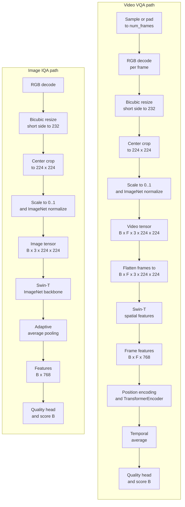

# deep-vqa-framework

[](https://www.python.org/)
[](https://pytorch.org/)
[](https://github.com/autentisitet/deep-vqa-framework/releases)
[](https://opensource.org/licenses/MIT)
[](https://github.com/autentisitet/deep-vqa-framework)
[](https://github.com/autentisitet/deep-vqa-framework)
[](https://github.com/autentisitet/deep-vqa-framework)

**🌐 [English](README.md) | [简体中文](README_zh.md)**

**An end-to-end platform for image and video quality assessment.**

Deep-VQA-Framework provides the engineering path from quality-labeled media to a usable IQA/VQA model: dataset inspection and integrity checks, leakage-aware splitting, reproducible training and evaluation, experiment artifacts, checkpoint selection, batch inference, and containerized API deployment. It is designed as an extensible platform for developing and operating image/video quality assessment models, rather than as a single model implementation.

The current default model uses a Swin-T backbone for image and per-frame spatial features. Video assessment adds positional encoding and Transformer-based temporal fusion. After training, selected checkpoints can be handed off to `deploy/` for batch or API inference.

---

## Table of Contents

- [Architecture & Design Decisions](#architecture-decisions)
- [Model Architecture](#model-architecture)
- [Training Pipeline](#training-pipeline)
- [Evaluation & Metrics](#evaluation-metrics)
- [Deployment & Inference API](#deployment-api)
- [Project Main Structure](#project-main-structure)
- [Docker / Podman Support](#docker-support)
- [System Overview](#system-overview)
- [Configuration Guide](#configuration-guide)
- [Troubleshooting](#troubleshooting)
- [Dependency Security](#dependency-security)
- [License](#license)
- [Acknowledgements](#acknowledgments)

---

## Architecture & Design Decisions <a id="architecture-decisions"></a>

### Design Contracts

The platform is organized around explicit contracts for data, models, configuration, evaluation, and deployment. This keeps the training and serving paths reproducible as new datasets and model variants are added.

| Contract | Implementation |
| :--- | :--- |
| **Modality routing** | 4D tensors are image batches, 5D tensors are video batches; invalid channel layouts fail early |
| **Backbone policy** | The image backbone is selected by the model configuration (Swin-T by default; ResNet50 supported); video reuses its spatial backbone with positional encoding and temporal fusion |
| **Preprocessing** | Images and sampled video frames use RGB, bicubic resize 232, center crop 224, and ImageNet mean/std normalization |
| **Data rejection** | Missing/corrupted media is removed before EDA and splitting; labels are backed up instead of rewritten to zero |
| **Split isolation** | Train/val/test and K-fold splits are group-aware to keep repeated reference content in one partition |
| **Artifacts** | Outputs use lowercase dataset keys under `results/{dataset}/`; successful runs publish `{dataset}_best.pt` into `deploy/` |
| **Runtime config** | Training and serving use typed Pydantic configuration with centralized path resolution |

---

## Model Architecture <a id="model-architecture"></a>

### IQAVQANet: Unified Quality Assessment Network



### Supported Configurations

| Input | Tensor Shape | Backbone | Normalization |
| :--- | :--- | :--- | :--- |
| Image | `[B, 3, H, W]` | Configured ImageNet backbone (Swin-T default; ResNet50 supported) | RGB, bicubic resize 232, center crop 224, ImageNet mean/std |
| Video | `[B, F, 3, H, W]` | Swin-T ImageNet backbone (`LayerNorm`) + Transformer temporal fusion | RGB frames, bicubic resize 232, center crop 224, `[0, 1]`, ImageNet mean/std |

The model no longer keeps legacy Swin compatibility shims. Checkpoints should be produced by the current `IQAVQANet` implementation.

### Loss Function: Task-Aware Hybrid Loss

`IQAVQALoss` combines robust MOS regression with pairwise ordering:

```text
Total Loss = w_huber × SmoothL1 + w_rank × PairwiseLogisticRank
```

| Task | SmoothL1 | Rank |
| :--- | :------- | :--- |
| IQA (`swin_iqa`) | 0.7 | 0.3 |
| VQA (`swin_vqa`) | 0.7 | 0.3 |

- **SmoothL1/Huber Loss**: Preserves MOS regression accuracy while reducing sensitivity to subjective-label outliers
- **Pairwise Logistic Rank Loss**: Optimizes pairwise ordering and ignores unreliable pairs below `rank_epsilon`

---

## Training Pipeline <a id="training-pipeline"></a>

### Quick Start Training

#### Step 1: Environment Setup

```bash
# Initialize environment and install dependencies
make install

# Check environment status
make info

# Download datasets, unrar and make symbol links
make data
```

#### Step 2: Training Commands

Run training directly with uv:

```bash
# TID2013 (Image Quality Assessment)
uv run python -m src.main --model swin_iqa --dataset tid2013

# KoNViD-1k (Video Quality Assessment)
uv run python -m src.main --model swin_vqa --dataset konvid-1k

# T2VQA-DB (Text-to-Video Quality Assessment)
uv run python -m src.main --model swin_vqa --dataset t2vqa-db
```

The training entry point runs the pipeline in this order:

```text
integrity check -> EDA/statistics -> group-aware train/val/test split -> group-aware K-fold training with ImageNet preprocessing -> plots -> checkpoint deployment
```

*Note: By default, DEBUG=0 is applied in make commands. You can override it by appending DEBUG=1 if needed.*

> [!NOTE]
> The default IQA configuration is `swin_iqa` (image/Swin-T). `resnet_iqa` remains an optional ResNet50 fallback, while `swin_vqa` uses Swin-T plus Transformer temporal fusion. Model configs are loaded from `config/models/*.yaml` by file name.

> [!NOTE]
> `scripts/setup_env.sh` also installs and verifies `hatchling`, so `deploy/` can be built from `pyproject.toml` without extra manual setup.

> [!WARNING]
> `--skip_integrity` skips media decoding checks and is intended only for fast debugging. Normal training should keep integrity checks enabled so corrupted/missing samples cannot enter cross-validation.

---

## Evaluation & Metrics <a id="evaluation-metrics"></a>

### Core Metrics

| Metric | Full Name | Interpretation |
| :--- | :--- | :--- |
| **PLCC** | Pearson Linear Correlation Coefficient | Linear relationship (accuracy) |
| **SROCC** | Spearman Rank Order Correlation Coefficient | Monotonic relationship (ranking) |
| **KROCC** | Kendall Rank Correlation Coefficient | Ordinal agreement |
| **RMSE** | Root Mean Square Error | Prediction error magnitude |
| **R²** | Coefficient of Determination | Variance explained |

### Visualizations

The framework automatically generates:

- **EDA Distribution**: MOS histogram and boxplot

- **Training History**: Loss curves, PLCC/SROCC progression

- **Residual Analysis**: Scatter plots, error distribution

- **Fold Summary**: Per-fold PLCC/SROCC/RMSE/R² summary and stability views

- **Fold Comparison**: Bar charts generated from available fold histories

Training, evaluation, and comparison plots are saved under `results/{dataset}/plots/`.
Dataset audit and EDA plots are saved under `results/{dataset}/eda/`.
Other artifacts, including logs, manifests, CSV files, and checkpoints, use the same
lowercase dataset key under `results/{dataset}/`; for example, `tid2013` and `konvid-1k`.

---

## Deployment & Inference API <a id="deployment-api"></a>

Training publishes the selected checkpoint to one of these task-specific locations:

```text
deploy/iqa-models/{dataset}_best.pt
deploy/vqa-models/{dataset}_best.pt
```

The checkpoint contains the model configuration and MOS range required by the
deployment loader. The API uses the task roles `iqa` and `vqa`; the actual
backbone is read from the loaded checkpoint.

### FastAPI Service

```bash
uv run python -m deploy.api
```

For containerized deployment, `make docker-infer` starts FastAPI and Nginx.
Nginx serves `frontend/` on host port `8000` and proxies `/api/health` and
`/api/evaluate`; set `WEB_PORT=80` to use port 80. Direct development with a
separate frontend origin requires `CORS_ALLOW_ORIGINS`.

At startup, the service loads available IQA/VQA checkpoints. `/health` reports
loaded tasks and device; startup fails if no checkpoint is available.

### Batch Inference

```bash
uv run python -m deploy.cli -i examples/images/
uv run python -m deploy.cli -i examples/videos/
uv run python -m deploy.cli -i examples/
```

The CLI selects the task-specific checkpoint, detects image/video files, and
writes JSON reports to `reports/iqa-test/` or `reports/vqa-test/`. The Make
targets `test-images`, `test-videos`, and `test-all` call this CLI.

---

## Project Main Structure <a id="project-main-structure"></a>

```text
deep-vqa-framework/
├── Makefile                # Automation & workflow commands
├── README.md               # Project overview
├── DISCLAIMER.md           # Legal liability & resource usage policy
├── pyproject.toml          # Dependency, environment & build management (uv + hatchling)
│
├── config/                 # YAML configuration files (user-editable)
│   ├── basic.yaml            # System & training global defaults
│   ├── dataset_config.yaml   # Dataset-specific metadata
│   └── models/                 # Model architecture parameters
│
├── datasets/                 # Data storage & symlink routing
│   ├── KoNViD-1k/               # Video quality dataset
│   ├── T2VQA-DB/                 # Text-to-Video QA dataset
│   └── TID2013/                  # Image quality dataset
│
├── docs/                     # Interactive architecture & manuals
│   ├── pipeline.html            # System execution & module flow
│   └── Cloud_Platform_Rental_Guide.md
|
├── reports/                  # Security reports from pip-audit, SBOM, and safety
|
├── results/
|   ├── {dataset}/
│   │   ├── train_logs/           # Training history, CSV logs
│   │   ├── plots/                # Loss curves, residual plots
│   │   ├── eda/                  # Dataset analysis plots
│   │   ├── model_outputs/        # Checkpoints (.pt files)
│   │   └── corrupted/            # Quarantined corrupt media + rejected label backups
│   └── scripts_logs/             # Shell script logs (setup, data, etc.)
|
├── docker/                   # Container configuration
│   ├── docker-compose.yaml      # Main compose config
│   ├── docker-compose.docker.yaml # Docker GPU support
│   └── docker-compose.podman.yaml # Podman GPU support
│
├── .github/workflows/        # CI/CD pipelines
│   └── ci.yaml                 # Continuous Integration
|
├── scripts/                  # Infrastructure automation
│   ├── bootstrap.sh             # System-level initialization (apt, mirrors, system tools)
│   ├── setup_env.sh             # Project-level initialization (uv, .venv, Python deps, hatchling install/verification)
│   ├── manage_data.sh           # Download & data preparation
│   ├── archive_results.sh       # Package results
│   ├── cache_clean.sh           # Cache cleanup
│   └── ci_test_extract.sh       # CI helper for smart_extract test
│
├── deploy/                  # Standalone inference service and batch CLI (decoupled from training)
│   ├── api.py                    # FastAPI service
│   ├── cli.py                    # Batch inference CLI
│   ├── core/                     # Runtime config, preprocessing, loading, inference helpers
│   ├── iqa-models/               # IQA .pt checkpoints served by api.py
│   └── vqa-models/               # VQA .pt checkpoints served by api.py
│
└── src/                       # Core framework logic
    ├── main.py                   # Global execution entry point
    ├── core/                        # Training engine & evaluation pipeline
    ├── data/                        # Data loaders, preprocessing, EDA & integrity analysis
    ├── models/                      # Backbones, heads, losses, metrics, and IQAVQANet
    ├── utils/                        # Configuration, logging & path management
    └── config/                     # Pydantic config system (code)
```

---

## Docker / Podman Support <a id="docker-support"></a>

The framework supports containerized development and deployment with both Docker and Podman.

### Quick Start with Docker

```bash
# Build and enter development container
make docker-dev

# Run training in container
make docker-train

# Start inference API service
make docker-infer

# Stop all containers
make docker-stop

# Batch inference on example images
make test-images

# Batch inference on example videos
make test-videos

# Batch inference on all examples
make test-all

# Remove containers, images, volumes, and networks
make docker-purge-all

# Check container environment
make docker-manage
```

### Container Configuration

| Component | Description |
| :--- | :--- |
| `Dockerfile` | Multi-stage builds: `base` (shared deps), `train` (training), `prod` (inference) |
| `docker-compose.yaml` | Main compose configuration with json-file log rotation and `.cache` mounts |
| `docker-compose.docker.yaml` | Docker-specific GPU support plus host-network builds |
| `docker-compose.podman.yaml` | Podman-specific GPU support plus host-network builds |

The Makefile auto-detects Docker vs Podman. For Podman users, `make docker-*` does not require `alias docker=podman`; aliases are only useful if you run container commands manually.

Dataset scripts detect `http_proxy`/`HTTP_PROXY`. On AutoDL cloud GPU instances, enable the platform proxy before downloading datasets:

```bash
source /etc/network_turbo
```

Torch/uv caches are mounted at `/app/.cache` in containers. Runtime services set `XDG_CACHE_HOME=/app/.cache`, `TORCH_HOME=/app/.cache/torch`, and `UV_CACHE_DIR=/app/.cache/uv`, so previously downloaded torchvision backbones can be reused.

If your host proxy is bound to `127.0.0.1`, remember that service `network_mode: host` applies to running containers, while image build steps need build networking. The compose overlays set `build.network: host`; to pass proxy variables into the Dockerfile build, run:

```bash
make docker-train BUILD_ARGS='--build-arg USE_BUILD_PROXY=true'
```

---

## System Overview <a id="system-overview"></a>

The interactive pipeline map is available at [docs/pipeline.html](docs/pipeline.html).

---

## Configuration Guide <a id="configuration-guide"></a>

Configuration is assembled by `load_config()` which returns a Pydantic `Config` object.
All settings are validated at load time with type checking.
Paths are resolved via `cfg.paths.xxx_dir(dataset_name)` methods.

| Stage | File | How it's merged |
| ------- | ------ | --------- |
| 1 (Base) | `basic.yaml` | Loaded first as the starting config |
| 2 (Model) | `models/{model}.yaml` | Deep-merged on top of stage 1 (matching keys override) |
| 3 (Dataset) | `dataset_config.yaml` | **Not merged into top-level keys** — the matched dataset entry is attached wholesale as `config["dataset"]` |

The merged result is validated by Pydantic when `Config(**merged)` is constructed. Path resolution is handled by Pydantic `PathsConfig` with typed methods.

---

## Troubleshooting <a id="troubleshooting"></a>

### CUDA Out of Memory (OOM)

Adjust the model YAML in this order, starting with the least disruptive change:

1. Keep `system.amp: true` on CUDA. AMP is implemented by the training engine and reduces activation memory.
2. Reduce `preprocessing.batch_size`.
3. Reduce `model.num_frames` for VQA.
4. Reduce `model.transformer_layers` for the temporal branch.
5. Increase `train.gradient_accumulation_steps` to preserve the effective batch size after lowering the physical batch size.
6. Use `resnet_iqa` only when a lighter image backbone is acceptable; it is an optional fallback, not the default IQA path.

`train.grad_clip` limits gradient values after backpropagation. It prevents unstable updates but does not reduce activation memory.

### Slow Training or High CPU Usage

| Symptom | Adjustment |
| :--- | :--- |
| Data loading is the bottleneck | Tune `preprocessing.num_workers` to the CPU and storage capacity; more workers are not always faster |
| GPU is underutilized | Increase `preprocessing.batch_size` only if GPU memory allows, and keep AMP enabled |
| Video batches are expensive | Reduce `model.num_frames` or use gradient accumulation with a smaller physical batch |
| Logs are noisy | Training progress updates are throttled to approximately 2% increments |

### Configuration Validation Errors

YAML is loaded and then validated by Pydantic with `extra="forbid"`. An unknown key is therefore an intentional configuration error, not a silently ignored option. Remove obsolete keys or add a corresponding schema and runtime consumer before using them.

### Disk Filling Up

`results/{dataset}/corrupted/` stores media and label backups moved aside by the integrity audit. Keep these files when investigating data quality; remove them only after the audit is no longer needed.

For routine maintenance:

```bash
make cache_clean
make results-clean
make archive
# Archive only results or only datasets:
make archive ARCHIVE_ARGS="--results"
make archive ARCHIVE_ARGS="--datasets"
```

`results-clean` asks for confirmation, then uses the `YYYYMMDD_HHMMSS` prefix in each filename to delete dated `.pt`, `.csv`, and `.log` files older than three days under `results/`. Files without that timestamp prefix, and files outside `results/`, are kept.

---

## Dependency Security <a id="dependency-security"></a>

The framework includes security tools to audit dependencies:

| Command | Purpose |
| :--- | :--- |
| `make vuln-audit` | Scan dependencies for known vulnerabilities |
| `make sbom` | Generate Software Bill of Materials (CycloneDX) |
| `make safety` | Check dependencies with Safety (legacy, requires login) |
| `make security-all` | Run all security checks |

> [!NOTE]
> `pip-audit` is the primary vulnerability scanner. `safety` requires registration or login.

---

## 📄 License <a id="license"></a>

- **Framework**: [MIT](LICENSE)
- **Author**: [@autentisitet](https://github.com/autentisitet)
- **Version**: 0.7.0

---

## 🙏 Acknowledgments <a id="acknowledgments"></a>

- PyTorch team for deep learning framework
- Decord developers for efficient video loading
- FastAPI for the production-ready API framework
- TID2013, KoNViD-1k, T2VQA-DB dataset providers

---

## ⚖️ Legal & Disclaimer
For details regarding third-party tool usage, dataset compliance, and resource usage, please refer to the [DISCLAIMER.md](DISCLAIMER.md) file.

---

For detailed contribution guidelines and issue reporting, please check the .github folder.

**Built with ❤️ for the research community**
