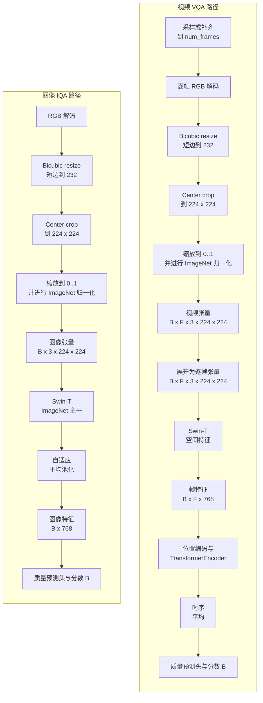

# deep-vqa-framework

[](https://www.python.org/)
[](https://pytorch.org/)
[](https://github.com/autentisitet/deep-vqa-framework/releases)
[](https://opensource.org/licenses/MIT)
<<<<<<< HEAD
[](https://github.com/autentisitet/deep-vqa-framework)
=======
[](https://github.com/autentisitet/deep-vqa-framework)
>>>>>>> origin/main
[](https://github.com/autentisitet/deep-vqa-framework)
[](https://github.com/autentisitet/deep-vqa-framework)

**🌐 [English](README.md) | [简体中文](README_zh.md)**

**一个面向图像和视频质量评估的端到端平台。**

Deep-VQA-Framework 提供从带质量标签的媒体数据到可用 IQA/VQA 模型的完整工程路径：数据检查与完整性审计、防止泄漏的分组划分、可复现训练与评估、实验产物管理、checkpoint 选择、批量推理以及容器化 API 部署。它的定位是一个可以持续扩展数据集和模型变体的图像/视频质量评估平台，而不是单一模型实现。

### 产品边界

核心产品是无参考图像/视频质量评估框架及其推理 API，能力分为四层：

- **核心能力：** 数据集流程、IQA/VQA 训练、评估、checkpoint 管理和推理。
- **部署能力：** FastAPI、Docker/Podman，以及单实例内网工作台或受保护的无状态 API。
- **前端能力：** 统一的浏览器工作台，支持上传、评分、历史记录和模型解释。
- **可选扩展：** 基于 Ollama 的技术质量描述和辅助主观评分，用于开发和快速验证。

内网部署定位为单实例工作台，不是多租户 SaaS 账号系统。API Key 是部署级访问控制，不是用户身份或角色管理系统。公网部署应使用无状态存储后端，并在 API 网关或反向代理层增加保护。Ollama 是可选组件，不替代框架自身的 IQA/VQA 模型。

多租户账号管理、通用媒体存储和托管式 SaaS 控制平面不在当前范围内。详见英文[知识库](knowledge/README.md)。

### 部署边界

当前支持的基线是单实例服务，通常拆分为两台主机：一台运行边缘 Nginx 和
静态前端，另一台运行 FastAPI 与模型。启用 SQLite 时，数据库必须放在
FastAPI 主机的本地磁盘；SQLite 不是网络数据库，不能由多台 API 主机共享。
Ollama 可以单独放在受保护的内网主机上。

企业级 TLS/WAF/API Gateway、身份提供商、多租户授权以及服务端数据库明确
不属于本项目的实现范围，也不是 Deep-VQA-Framework 计划实现的功能。组织
如果有需要，可以在服务外围提供这些基础设施。文档中的 API Key 只是可信
单实例部署的服务级访问令牌，不是用户身份系统。

当前默认模型使用 Swin-T 提取图像和视频逐帧空间特征；视频分支进一步使用位置编码和 Transformer 进行时序融合。训练完成后，选定的 checkpoint 可以交付到 `deploy/`，用于批量推理或 API 服务。

媒体后缀由统一注册表分类。JPG/PNG/WEBP 以及常见的 MP4/MOV/MKV 是默认训练和服务格式；HEIC、AVIF、GIF 以及专业视频容器只标记为实验格式。后缀名不被视为文件身份，OpenCV/Decord 必须实际成功解码文件内容，因此伪造后缀的文件会在处理阶段被拒绝。

---

## 目录

- [架构与设计决策](#architecture-decisions)
- [模型架构](#model-architecture)
- [训练流程](#training-pipeline)
- [评估与指标](#evaluation-metrics)
- [部署与推理 API](#deployment-api)
<<<<<<< HEAD
- [开发者知识库（英文）](knowledge/README.md)
- [部署指南（英文）](knowledge/deployment.md)
- [前端指南（英文）](knowledge/frontend.md)
- [Ollama 指南（英文）](knowledge/ollama.md)
=======
- [部署指南](deploy/GUIDE_zh.md)
>>>>>>> origin/main
- [前端](frontend/index.html)
- [项目主要结构](#project-main-structure)
- [Docker / Podman 支持](#docker-support)
- [系统概览](#system-overview)
- [配置指南](#configuration-guide)
- [故障排查](#troubleshooting)
- [依赖项安全](#dependency-security)
- [许可证](#license)
- [安全策略](SECURITY.md)
- [致谢](#acknowledgments)
- [参考文献](#references)

---

## 架构与设计决策 <a id="architecture-decisions"></a>

### 设计约束

这个平台围绕数据、模型、配置、评估和部署建立明确约束，使训练和推理链路能够在加入新数据集或模型变体后保持可复现和可维护。

| 约束 | 实现方式 |
| :--- | :--- |
| **模态路由** | 4D 张量视为图像 batch，5D 张量视为视频 batch；通道布局不合法会提前失败 |
| **Backbone 策略** | 图像主干由模型配置选择（默认 Swin-T，也支持 ResNet50）；视频复用对应空间主干并增加位置编码与时序融合 |
| **预处理** | 图像和采样视频帧使用 RGB、bicubic resize 232、center crop 224 和 ImageNet mean/std 归一化 |
| **数据剔除** | 缺失/损坏媒体在 EDA 和划分前剔除；标签备份，不会改写成 0 分 |
| **划分隔离** | train/val/test 和 K 折都做分组划分，同一参考内容只进入一个分区 |
| **产物路径** | 输出使用小写数据集 key 放在 `results/{dataset}/`；成功训练后发布 `{dataset}_best.pt` 到 `deploy/` |
| **运行配置** | 训练和推理共用 Pydantic 类型化配置，并集中处理路径解析 |

---

## 模型架构 <a id="model-architecture"></a>

### IQAVQANet：统一质量评估网络



### 支持的配置

| 输入 | 张量形状 | 主干网络 | 归一化 |
| :--- | :--- | :--- | :--- |
| 图像 | `[B, 3, H, W]` | 配置指定的 ImageNet 主干（默认 Swin-T，也支持 ResNet50） | RGB、bicubic resize 232、center crop 224、ImageNet mean/std |
| 视频 | `[B, F, 3, H, W]` | Swin-T ImageNet backbone (`LayerNorm`) + Transformer 时序融合 | RGB 帧、bicubic resize 232、center crop 224、`[0, 1]`、ImageNet mean/std |

当前代码库要求检查点由现行 `IQAVQANet` 实现生成。本仓库没有 `v0.7.3` tag，因此这里不对无法核验的历史版本差异作断言。

### 损失函数：任务感知混合损失

`IQAVQALoss` 将稳健 MOS 回归与成对排序结合：

```text
总损失 = w_huber × SmoothL1 + w_rank × PairwiseLogisticRank
```

| 任务 | SmoothL1 | Rank |
| :--- | :------- | :--- |
| IQA (`swin_iqa`) | 0.7 | 0.3 |
| VQA (`swin_vqa`) | 0.7 | 0.3 |

- **SmoothL1/Huber 损失**：保持 MOS 回归精度，同时降低主观标签离群值的影响
- **Pairwise Logistic Rank 损失**：优化成对排序，并忽略差异小于 `rank_epsilon` 的不可靠样本对

---

## 训练流程 <a id="training-pipeline"></a>

### 快速开始训练

#### 第 1 步：环境配置

```bash
# 初始化环境并安装依赖
make install DEV=1

# 检查环境状态
make info

# 下载数据集、解压（unrar）并创建符号链接
make data
```

#### 第 2 步: 训练命令

直接使用 `uv` 运行训练：

```bash
# TID2013 (图像质量评估)
uv run python -m src.main --model swin_iqa --dataset tid2013

# KoNViD-1k (视频质量评估)
uv run python -m src.main --model swin_vqa --dataset konvid-1k

# T2VQA-DB (文生视频质量评估)
uv run python -m src.main --model swin_vqa --dataset t2vqa-db
```

> 数据集属性说明：TID2013 是全参考图像质量评估（FR-IQA）数据集，每个失真图像对应一张原始参考图；KoNViD-1k 是无参考视频质量评估（NR-VQA）数据集。本项目当前的 TID2013 训练/推理入口只读取失真图像和 MOS，不将参考图像作为模型输入，因此实际运行仍是单图 IQA 流程。

训练入口按以下顺序执行：

```text
完整性检查 -> EDA/统计分析 -> 分组 train/val/test 划分 -> 解码时应用 ImageNet 预处理的分组 K 折训练 -> 训练图表 -> 检查点部署
```

*注意：默认情况下，`make` 命令使用 `DEBUG=0`。如有需要，可通过追加 `DEBUG=1` 来覆盖此设置。*

> [!NOTE]
> 默认 IQA 配置是 `swin_iqa`（图像/Swin-T）；`resnet_iqa` 保留为可选的 ResNet50 回退配置，`swin_vqa` 使用 Swin-T 加 Transformer 时序融合。模型配置按 `train-config/models/*.yaml` 的文件名加载。

> [!NOTE]
> `scripts/setup_env.sh` 会安装并验证 `hatchling`，因此 `deploy/` 可以直接通过 `pyproject.toml` 完成构建，无需额外手动配置。

> [!WARNING]
> `--skip_integrity` 只建议用于快速调试。正常训练应保留完整性检查，避免缺失或损坏样本进入交叉验证。

---

## 评估与指标 <a id="evaluation-metrics"></a>

### 核心指标

| 指标 | 全称 | 解读 |
| :--- | :--- | :--- |
| **PLCC** | Pearson 线性相关系数 | 线性关系（准确度） |
| **SROCC** | Spearman 等级相关系数 | 单调关系（排序） |
| **KROCC** | Kendall 等级相关系数 | 序数一致性 |
| **RMSE** | 均方根误差 | 预测误差幅度 |
| **R²** | 决定系数 | 可解释方差 |

### 可视化图表

该框架会自动生成：

- **EDA 分布图**：MOS 直方图与箱线图
- **训练历史**：Loss、PLCC/SROCC/KROCC、RMSE/R² 及其他可用训练指标
- **残差诊断**：Residual vs Predicted MOS、Residual vs True MOS、真实值-预测值散点图与误差分布
- **MOS 区间分析**：按真实 MOS 区间统计平均绝对误差
- **Fold 汇总与比较**：每折 PLCC/SROCC/RMSE/R² 汇总、稳定性视图与对比柱状图
- **样本级误差报告**：完整预测 manifest，以及自动导出的 top-k 高误差样本
- **特征可解释性**：图像输入的 backbone 特征图网格与回归 Grad-CAM 热力图
<<<<<<< HEAD
- **主观质量评估**：可选的 Ollama 视觉小模型，为当前前端请求生成质量描述、评分和贝叶斯后验

浏览器前端聚焦于媒体上传、无参考 IQA/VQA 推理、模型输出和可解释性。对于训练集分布分析，建议采用离线特征产物流程：先对训练集全部样本提取特征，在训练划分上一次性拟合 PCA，保存投影和归一化参数；出现问题样本时，将它投影到同一个特征空间中进行对比。

可选的主观评估使用 Ollama 和 `deploy-config/ollama/Modelfile`。服务会对当前图像或少量视频帧请求技术质量描述及 0–100 分，再使用中性 Beta 先验计算贝叶斯后验分数和近似 95% 区间。该结果仅返回给当前请求，不写入 SQLite 或 JSONL 历史记录。

```bash
make env-secrets
make docker-infer-internal-ollama
# 统一健康检查：
make docker-deploy-check
make docker-stop
```

`make docker-infer` 是默认 internal 模式，不会启动 Ollama。
`make docker-infer-internal-ollama` 会启动可选的 Ollama 容器，并初始化
`qwen2.5vl:3b` 模型。

Ollama Compose 会挂载 `Modelfile`，并使用 `vqa-ollama` 镜像临时执行模型初始化来下载
`qwen2.5vl:3b` 和创建 `deep-vqa-subjective`；仅挂载 Modelfile 不会自动创建模型。

详细配置见英文 [Ollama 指南](knowledge/ollama.md)。

这样既保持训练好的无参考 IQA/VQA 模型作为核心能力，也能让数据集覆盖范围和异常样本分析可复现。保存的特征产物应包含特征提取器/checkpoint 标识、数据集划分、样本 ID、特征归一化参数、PCA 均值与主成分以及二维坐标。

该流程已在 `src/data/eda/feature_distribution.py` 中实现：

```bash
# 只使用 train 划分拟合训练集分布
uv run python -m src.data.eda.feature_distribution build \
  --checkpoint deploy/vqa-models/konvid-1k_best.pt \
  --dataset konvid-1k

=======

浏览器前端聚焦于媒体上传、无参考 IQA/VQA 推理、模型输出和可解释性。对于训练集分布分析，建议采用离线特征产物流程：先对训练集全部样本提取特征，在训练划分上一次性拟合 PCA，保存投影和归一化参数；出现问题样本时，将它投影到同一个特征空间中进行对比。

这样既保持训练好的无参考 IQA/VQA 模型作为核心能力，也能让数据集覆盖范围和异常样本分析可复现。保存的特征产物应包含特征提取器/checkpoint 标识、数据集划分、样本 ID、特征归一化参数、PCA 均值与主成分以及二维坐标。

该流程已在 `src/data/eda/feature_distribution.py` 中实现：

```bash
# 只使用 train 划分拟合训练集分布
uv run python -m src.data.eda.feature_distribution build \
  --checkpoint deploy/vqa-models/konvid-1k_best.pt \
  --dataset konvid-1k

>>>>>>> origin/main
# 将问题样本投影到已保存的同一空间
uv run python -m src.data.eda.feature_distribution project \
  --artifact results/konvid-1k/eda/feature_distribution/train_pca.npz \
  --checkpoint deploy/vqa-models/konvid-1k_best.pt \
  --input path/to/problem.mp4 \
  --output results/konvid-1k/eda/feature_distribution/problem_projection.json
```

构建命令会保存压缩后的特征/PCA 产物、元数据 JSON 和训练集散点图；投影命令
会输出 PCA 坐标、最近训练样本及经验最近距离百分位，并生成问题样本散点图。
特征来自 `IQAVQANet.extract_quality_features()`，与实际推理使用同一条模型特征路径。

完整的产物目录与文件组织见后文“项目结构”章节。

---

## 部署与推理 API <a id="deployment-api"></a>

完整的部署矩阵、认证配置、存储模式、Ollama 变体、API 路由、批量 CLI 和排障说明请参阅英文[部署指南](knowledge/deployment.md)。本节只保留项目级入口和简要说明。

训练完成后，选定的 checkpoint 会发布到对应任务目录：

```text
deploy/iqa-models/{dataset}_best.pt
deploy/vqa-models/{dataset}_best.pt
```

checkpoint 中包含部署加载器所需的模型配置和 MOS 区间。API 使用 `iqa`
和 `vqa` 两个任务角色，具体 backbone 从加载的 checkpoint 中读取。
checkpoint 的使用和发布限制请参阅 [DISCLAIMER_zh.md](DISCLAIMER_zh.md)，再进行再分发。

### FastAPI 服务

主机直运行、Docker/Podman 启动、API 路由、批量 CLI、代理、SELinux 挂载和排障
<<<<<<< HEAD
请参阅英文[部署指南](knowledge/deployment.md)。
=======
请参阅专门的[中文部署指南](deploy/GUIDE_zh.md)，也可查看[英文版](deploy/GUIDE.md)。
>>>>>>> origin/main

```bash
uv run python -m uvicorn deploy.api:app --host 127.0.0.1 --port 8000
```

容器化部署使用 `make docker-infer`，它会启动 FastAPI 和 Nginx。Nginx 默认通过
宿主机 `8000` 端口提供 `frontend/`，并代理 `/api/v1/*`；
设置 `WEB_PORT=80` 可改用 80 端口。直接开发时，如果前端和 API 不同源，需要设置
`CORS_ALLOW_ORIGINS`。

FastAPI 会自动生成 OpenAPI 接口文档：

```text
Swagger UI: http://localhost:8000/api/docs
ReDoc:      http://localhost:8000/api/redoc
OpenAPI:    http://localhost:8000/api/openapi.json
```

主要 REST 资源包括 `GET /api/v1/health`、`GET /api/v1/models`、
<<<<<<< HEAD
`GET /api/v1/models/{model_id}`、`GET /api/v1/frontend-evaluations`、
`POST /api/v1/evaluations?model_id=iqa`，以及不写入历史的
`POST /api/v1/subjective-assessments`。
=======
`GET /api/v1/models/{model_id}` 和 `POST /api/v1/evaluations?model_id=iqa`。
>>>>>>> origin/main
评估接口接收一个 multipart `file`，并返回带类型约束的评估资源。

服务启动时还会把动态生成的接口 schema 保存到 `docs/openapi.json`，
便于离线查看和纳入版本控制。
生产环境的 Compose 会将宿主机 `docs/` 挂载到容器，因此重建容器后该文件仍会保留。

如果不经过 Nginx、直接启动 FastAPI，则使用 `/docs`、`/redoc` 和
`/openapi.json`，不需要 `/api` 代理前缀。

服务启动时加载可用的 IQA/VQA checkpoint。`/api/v1/health` 返回已加载任务和推理设备；
如果没有任何 checkpoint，服务会启动失败。

### 批量推理

```bash
uv run python -m deploy.cli -i examples/images/
uv run python -m deploy.cli -i examples/videos/
uv run python -m deploy.cli -i examples/

# 可选：生成单张图像的特征图和 Grad-CAM
uv run python -m deploy.cli -i examples/images/sample.jpg --visualize
```

可视化产物会持久化到 `reports/iqa-test/`。前端会将缩略原图与特征图、
Grad-CAM 并列显示；双击任意对比图片即可打开大图预览。

CLI 会选择对应任务的 checkpoint，自动识别图像和视频文件，并将 JSON 结果写入
`reports/iqa-test/` 或 `reports/vqa-test/`。`test-images`、`test-videos` 和
`test-all` 这些 Make 目标都会调用这个 CLI。MOS 范围会根据 checkpoint 中的数据集
<<<<<<< HEAD
标识，从 `train-config/dataset_config.yaml` 读取。
=======
标识，从 `config/dataset_config.yaml` 读取。
>>>>>>> origin/main

---

## 项目主要结构 <a id="project-main-structure"></a>

```text
deep-vqa-framework/
├── Makefile                # 自动化与工作流命令
├── README.md               # 项目概览
├── DISCLAIMER.md           # 法律责任与资源使用政策
├── pyproject.toml          # 依赖、环境与构建管理 (uv + hatchling)
│
├── train-config/           # 训练默认值、数据集元数据和模型 YAML 配置
│   ├── basic.yaml            # 系统与训练默认设置
│   ├── dataset_config.yaml   # 数据集特定元数据
│   └── models/               # 模型架构参数
│
├── datasets/                 # 数据存储与符号链接路由
│   ├── KoNViD-1k/               # 视频质量数据集
│   ├── T2VQA-DB/                 # 文本到视频问答 (T2VQA) 数据集
│   └── TID2013/                  # 图像质量数据集
│
├── docs/                     # 交互式架构图与使用手册
│   └── openapi.json             # 生成的 API schema
|
├── reports/                  # 推理产物、特征图、Grad-CAM 与安全报告
│   ├── iqa-test/                # IQA JSON 与特征图/Grad-CAM 报告
│   └── vqa-test/                # VQA 批量推理 JSON 报告
|
├── results/
│   ├── diagnostics/             # 特征图与 Grad-CAM 输出
|   ├── {dataset}/
│   │   ├── train_logs/           # 训练历史记录、CSV 日志
│   │   ├── plots/                # 损失曲线、残差图
│   │   ├── analysis/             # 误差诊断与分组指标
│   │   │   └── errors/           # 高误差样本与 MOS 区间汇总
│   │   ├── eda/                  # 数据集分析图表
│   │   ├── model_outputs/        # .pt 文件
│   │   └── corrupted/            # 隔离的损坏媒体文件与被拒绝标签备份
│   └── scripts_logs/             # Shell 脚本日志 (setup, data, etc.)
|
├── deploy-config/            # 部署 profile、Compose、Nginx、Ollama
│   ├── profiles/               # internal/public 部署策略
│   ├── compose/                # 基础 Compose 与 Docker/Podman 覆盖
│   ├── nginx/                  # 反向代理配置
│   └── ollama/                 # 可选 Ollama Compose 与 Modelfile
│
├── .github/workflows/        # CI/CD 流水线
│   └── ci.yaml                 # 持续集成
|
├── scripts/                  # 基础设施自动化脚本
│   ├── bootstrap.sh             # 系统级初始化（apt、镜像源、系统工具）
│   ├── setup_env.sh             # 项目级初始化（uv、.venv、Python 依赖、hatchling 安装/验证）
│   ├── manage_data.sh           # 数据下载与预处理
│   ├── archive_results.sh       # 结果打包归档
│   ├── cache_clean.sh           # 缓存清理
│   └── ci_test_extract.sh       # smart_extract 测试的 CI 辅助脚本
│
├── deploy/                  # 独立推理服务与批量 CLI（与训练解耦）
│   ├── api.py                    # FastAPI 服务
│   ├── cli.py                    # 图像/视频批量推理 CLI
│   ├── core/                     # 运行时配置、预处理、加载与推理辅助函数
│   ├── iqa-models/               # 由 api.py 提供的 IQA .pt 模型权重
│   └── vqa-models/               # 由 api.py 提供的 VQA .pt 模型权重
│
├── frontend/                # 面向模型推理的静态浏览器界面
│   ├── index.html                 # 上传、推理和可解释性界面
<<<<<<< HEAD
=======
│   └── index.html                 # 上传、推理和可解释性界面
>>>>>>> origin/main
│
└── src/                       # 核心框架逻辑
    ├── main.py                   # 全局执行入口
    ├── core/                        # 训练引擎与评估流程
    ├── data/                        # 数据加载器、预处理、EDA（探索性数据分析）与完整性分析
    │   └── eda/feature_distribution.py # 训练集特征/PCA 产物与投影 CLI
    ├── models/                      # Backbones、heads、losses、metrics 与 IQAVQANet
    ├── utils/                        # 配置、日志记录与路径管理
    ├── config/                     # Pydantic 配置系统（代码实现）
    └── visualization/              # 训练绘图与特征图/Grad-CAM 可视化
```

---

## Docker / Podman 支持 <a id="docker-support"></a>

<<<<<<< HEAD
完整部署流程和内网/公网模式矩阵请参阅英文[部署指南](knowledge/deployment.md)。前端登录、历史记录、无状态模式和无障碍说明见英文[前端指南](knowledge/frontend.md)。
=======
完整部署流程请参阅[中文部署指南](deploy/GUIDE_zh.md)，也可查看[英文部署指南](deploy/GUIDE.md)。
>>>>>>> origin/main

该框架支持使用 Docker 和 Podman 进行容器化开发与部署。

### Docker 开发部署方法

```bash
# 构建并进入开发容器
make docker-dev

# 在容器内运行训练
make docker-train

# 创建 internal 模式所需密钥（可重复执行）
make env-secrets

# 启动推理 API 服务
make docker-infer

# 停止所有容器
make docker-stop

# 对示例图像做批量推理
make test-images

# 对示例视频做批量推理
make test-videos

# 对全部示例做批量推理
make test-all

# 清理容器、镜像、卷和网络
make docker-purge-all

# 检查容器环境
make docker-manage
```

### 容器配置

| 组件 | 描述 |
| :--- | :--- |
<<<<<<< HEAD
| `Dockerfile` | 多阶段构建：`base`（共享依赖）、`dev`（挂载式开发 shell）、`train`（训练）、`prod`（推理） |
| `deploy-config/compose/docker-compose.yaml` | 基础服务、bridge 网络、端口、挂载和健康检查 |
| `deploy-config/compose/docker-compose.docker.yaml` | Docker 专用 NVIDIA runtime 配置 |
| `deploy-config/compose/docker-compose.podman.yaml` | Podman GPU device、SELinux 选项和挂载标签 |

### 镜像、服务、容器与网络的关系

这几个概念不是同义词：镜像是构建或下载得到的模板；Compose service
是镜像、挂载、环境变量、端口、健康检查和网络的声明；容器是该 service
创建出的运行实例。项目中的自定义镜像来自 `Dockerfile` 的 `dev`、`train`
和 `prod` 阶段，Nginx 与 Ollama 使用官方镜像。

默认推理链路如下：

```text
浏览器 :8000 -> vqa-nginx:80 -> vqa-infer:8000 -> IQA/VQA checkpoint
                                      └-> vqa-ollama:11434（启用主观评估时）
```

`backend` 是 Compose 创建的单机 bridge 网络。容器之间使用 service 名称
通信（例如 `vqa-infer:8000`），宿主机访问则使用发布端口：Nginx `8000`、
FastAPI `8001`，Ollama 可选 `11434`。这些端口默认只绑定到
`127.0.0.1`，不能把宿主机端口和容器内部端口混为一谈。

启动顺序是：先构建/拉取镜像；`vqa-infer` 加载模型并通过健康检查后，
`vqa-nginx` 才启动。Ollama 是可选且独立的，`*-ollama` 命令会先启动它、
初始化模型，再让 FastAPI 使用 `http://vqa-ollama:11434`。模型初始化是
同一 Ollama 镜像执行的一次性任务，不是长期运行的独立 service。

因此这是一组小型单机服务组合，不是 Kubernetes 微服务平台；Docker/Podman
Compose 文件只负责运行时差异（GPU、SELinux 挂载标签），不会改变应用拓扑。
=======
| `Dockerfile` | 多阶段构建：`base`（共享依赖）、`train`（训练）、`prod`（推理） |
| `docker-compose.yaml` | 主 Compose 配置文件，包含 API 健康检查、`json-file` 日志轮转、模型/报告/缓存挂载以及持久化 OpenAPI 输出 |
| `docker-compose.docker.yaml` | Docker 专用 GPU 支持，并为构建阶段启用 host 网络 |
| `docker-compose.podman.yaml` | Podman 专用 GPU 支持，并为构建阶段启用 host 网络 |
>>>>>>> origin/main

Makefile 会自动识别 Docker 或 Podman。Podman 用户直接运行 `make docker-*` 即可，不需要设置 `alias docker=podman`；只有手动运行容器命令时才可能需要 alias。

使用 `make help` 查看命令索引，使用 `make help-TARGET` 查看单个目标的详细说明，例如 `make help-docker-infer` 或 `make help-docker-purge-all`。Podman 同时支持启用和未启用 SELinux 的发行版；Podman overlay 会在 SELinux 主机上应用 `:Z` 标签，在 Ubuntu 等其他发行版上也可以正常使用。

可根据开发场景选择启动模式：

```bash
<<<<<<< HEAD
make docker-infer              # 完整 API + Nginx + 前端，默认使用 internal 策略
# 无状态公网策略：
make docker-infer DEPLOYMENT_MODE=public
=======
make docker-api       # API-only 开发模式，直接访问 http://127.0.0.1:8001
make docker-infer     # 完整 API + Nginx + 前端模式，自动等待并验证健康状态
>>>>>>> origin/main
```

如果主机已经准备好 Python 环境和模型检查点，也可以不使用容器，直接运行 API：

```bash
<<<<<<< HEAD
uv run python -m uvicorn deploy.api:app --host 127.0.0.1 --port 8000
```

主机直运行时使用 `--host 127.0.0.1`；容器镜像使用 `0.0.0.0` 是为了
让端口映射能够访问容器内监听器。主机直运行时访问
`http://127.0.0.1:8000/v1/health` 和 `http://127.0.0.1:8000/docs`；使用
Nginx 时使用带 `/api` 前缀的路径，例如 `/api/v1/health`。

前端行为、登录流程、存储模式相关能力和主机直运行预览见英文[前端指南](knowledge/frontend.md)。

前端评估历史可通过 deployment profiles 插拔：内网单实例部署使用 `evaluation_store.backend: sqlite`，公网无状态部署使用 `none`。启用 SQLite 时，每条记录包含浏览器会话范围，以及 `timestamp`、`file_name`、`file_hash`（SHA-256）、`task_type`、`model_used`、`mos_score`、`mos_interval` 和 `inference_time_ms`；前端只读取当前会话的记录，并可将已选或全部记录导出为 JSONL。会话范围只是隔离便利，不是用户身份认证。

上传和 SQLite 安全限制统一定义在 deployment profiles：上传默认上限为 100 MiB、读取超时为 30 秒；前端 SQLite 数据库默认上限为 256 MiB、忙等待超时为 5 秒。修改该文件即可调整共享部署策略。主机相关的服务地址、端口、代理和可选 SQLite 路径仍放在 `.env` 中。
=======
uv run python -m uvicorn deploy.api:app --host 0.0.0.0 --port 8000
```

主机直运行时访问 `http://127.0.0.1:8000/v1/health` 和 `http://127.0.0.1:8000/docs`；使用 Nginx 时使用带 `/api` 前缀的路径，例如 `/api/v1/health`。

前端的响应式与无障碍检查说明见 [docs/ACCESSIBILITY.md](docs/ACCESSIBILITY.md)。页面支持键盘操作和减少动画模式；正式声明符合 WCAG 仍需要运行 Lighthouse/axe 检查，并进行人工辅助技术测试。

前端评估记录会以每行一个 JSON 对象的 JSONL 格式追加到 `reports/frontend-evaluations.jsonl`。每条记录包含 `timestamp`、`file_name`、`file_hash`（SHA-256）、`task_type`、`model_used`、`mos_score`、`mos_interval` 和 `inference_time_ms`。
>>>>>>> origin/main

数据集脚本会检测 `http_proxy`/`HTTP_PROXY`。在 AutoDL 云 GPU 实例上，下载数据集前可以先启用平台代理：

```bash
source /etc/network_turbo
```

<<<<<<< HEAD
Compose 只会将代理变量传入需要下载依赖或模型的服务。Nginx 不需要代理配置；推理和 Ollama 服务会在 `NO_PROXY`/`no_proxy` 中保留内部服务名。
=======
Compose 会将宿主机可选的大小写代理变量传入容器，同时自动在 `NO_PROXY`/`no_proxy` 中追加 localhost、Compose 服务名和容器名。因此，无论宿主机是否启用代理，健康检查及 API 与 Nginx 之间的容器通信都不会绕行代理。

通用 Docker Compose 文件使用可移植的普通 bind mount；在启用 SELinux 的 Fedora/RHEL 主机上，Podman overlay 会为 Nginx 的前端目录和 `default.conf` 自动追加 `:Z` 并重新标记文件。若容器是在加入该选项前创建的，请先执行 `podman-compose down`，再重新 `up -d` 创建容器。

容器内的 torch/uv 缓存挂载到 `/app/.cache`。运行服务会设置 `XDG_CACHE_HOME=/app/.cache`、`TORCH_HOME=/app/.cache/torch` 和 `UV_CACHE_DIR=/app/.cache/uv`，因此已下载的 torchvision backbone 可以复用。
>>>>>>> origin/main

通用 Docker Compose 文件使用可移植的普通 bind mount；在启用 SELinux 的 Fedora/RHEL 主机上，Podman overlay 会为 Nginx 的前端目录和 `default.conf` 自动追加 `:Z` 并重新标记文件。若容器是在加入该选项前创建的，请先执行 `podman-compose down`，再重新 `up -d` 创建容器。

宿主机 `.cache` 目录会挂载到容器的 `/app/.cache`。生产镜像定义了
`XDG_CACHE_HOME=/app/.cache` 和 `TORCH_HOME=/app/.cache/torch`，因此已下载
的 torchvision/PyTorch 模型可以复用。`UV_CACHE_DIR` 不放入生产镜像，因为
uv 只用于构建和开发，不是服务运行时依赖。

如果宿主机代理绑定在 `127.0.0.1`，Dockerfile 构建步骤需要能够访问宿主机代理。若要将代理变量传入 Dockerfile 构建，运行：

```bash
make docker-train BUILD_ARGS='--build-arg USE_BUILD_PROXY=true' DEV=1
```

---

## 系统概览 <a id="system-overview"></a>

交互式流水线图见英文[知识库架构图](knowledge/architecture.html)。

---

## 配置指南 <a id="configuration-guide"></a>

配置由 `load_config()` 函数组装，并返回一个 Pydantic `Config` 对象。
所有设置均在加载时进行验证和类型检查。
路径通过 `cfg.paths.xxx_dir(dataset_name)` 方法进行解析。

预处理 action 由 `src.data.preprocessing.PREPROCESSING_REGISTRY` 登记。
注册表记录图像/视频 action key、媒体类型、实现方法和有序步骤（校验、缩放/裁剪、
归一化），用于审计和扩展；当前模型路径仍直接使用已登记的 ImageNet 图像/视频 action。

| 阶段 | 文件 | 合并方式 |
| ------- | ------ | --------- |
| 1 (基础) | `basic.yaml` | 首先加载作为初始配置 |
| 2 (模型) | `models/{model}.yaml` | 在阶段 1 基础上进行深度合并（匹配的键会被覆盖） |
| 3 (数据集) | `dataset_config.yaml` | **未合并至顶层键** — 匹配的数据集条目将作为 `config["dataset"]` 整体附加 |

合并后的结果会在构造 `Config(**merged)` 时由 Pydantic 校验。路径解析由 Pydantic 的 `PathsConfig` 及其类型化方法处理。

---

## 故障排查 <a id="troubleshooting"></a>

### CUDA 显存溢出（OOM）

建议按以下顺序调整，先采用影响较小的措施：

1. 在 CUDA 上保持 `system.amp: true`。训练引擎已实现 AMP，可降低激活值显存占用。
2. 减小 `preprocessing.batch_size`。
3. 对 VQA 减小 `model.num_frames`。
4. 减少视频时序分支的 `model.transformer_layers`。
5. 减小实际 batch 后增加 `train.gradient_accumulation_steps`，保持有效 batch size。
6. 只有在可以接受更轻量图像 backbone 时，才使用 `resnet_iqa`；默认 IQA 路径仍然是 Swin-T。

`train.grad_clip` 在反向传播后限制梯度值，用于抑制训练不稳定，但不会降低激活值显存占用。

### 训练慢或 CPU 占用高

| 现象 | 调整方式 |
| :--- | :--- |
| 数据加载成为瓶颈 | 根据 CPU 和存储速度调整 `preprocessing.num_workers`，worker 越多不一定越快 |
| GPU 利用率偏低 | 在显存允许时增加 `preprocessing.batch_size`，并保持 AMP 开启 |
| 视频 batch 成本高 | 减小 `model.num_frames`，或使用更小的实际 batch 配合梯度累积 |
| 日志输出过密 | 训练进度条已限制在约 2% 的增量更新 |

### 配置校验错误

YAML 加载后会由 Pydantic 使用 `extra="forbid"` 校验。未知键会被视为明确的配置错误，不会静默忽略。删除过时字段，或者先为它补充 schema 和实际运行时读取逻辑。

### 磁盘空间耗尽

`results/{dataset}/corrupted/` 保存完整性审计时隔离的媒体和标签备份。排查数据质量期间应保留这些文件，确认不再需要后再清理。

日常维护命令：

```bash
make cache_clean
make results-clean
make archive
# 仅归档结果或数据集：
make archive ARCHIVE_ARGS="--results"
make archive ARCHIVE_ARGS="--datasets"
```

`results-clean` 会要求确认，然后使用文件名开头的 `YYYYMMDD_HHMMSS` 删除
`results/` 下三天以前的 `.pt`、`.csv` 和 `.log` 文件。没有该时间戳前缀的文件，
以及 `results/` 之外的文件都会保留。

---

## 依赖项安全 <a id="dependency-security"></a>

安全问题请通过
[SECURITY.md](SECURITY.md) 中的私下报告流程提交，不要公开利用步骤或敏感信息。

该框架包含用于审计依赖项的安全工具：

| 命令 | 用途 |
| :--- | :--- |
| `make vuln-audit` | 扫描依赖项中的已知漏洞 |
| `make sbom` | 生成软件物料清单 (SBOM/CycloneDX) |
| `make safety` | 使用 Safety 检查依赖项（旧版工具，需登录） |
| `make security-all` | 运行所有安全检查 |

> [!NOTE]
> `pip-audit` 是主要的漏洞扫描工具。`safety` 工具需要注册或登录。

---

## 📄 许可证 <a id="license"></a>

- **框架**: [MIT](LICENSE)
- **作者**: [@autentisitet](https://github.com/autentisitet)
<<<<<<< HEAD
- **版本**: 0.9.0
=======
- **版本**: 0.7.5
>>>>>>> origin/main

---

## 🙏 致谢 <a id="acknowledgments"></a>

- PyTorch 团队（提供深度学习框架）
- Decord 开发者（提供高效视频加载功能）
- FastAPI（提供生产级 API 框架）
- TID2013、KoNViD-1k、T2VQA-DB 数据集提供方

---

## 参考文献 <a id="references"></a>

- Liu, Z., et al. (2021). *Swin Transformer: Hierarchical Vision Transformer Using Shifted Windows.* ICCV. [论文](https://arxiv.org/abs/2103.14030)
- He, K., et al. (2016). *Deep Residual Learning for Image Recognition.* CVPR. [论文](https://arxiv.org/abs/1512.03385)
- Chen, L.-C., et al. (2017). *Understanding Convolution for Semantic Segmentation.* arXiv:1702.08502. [论文](https://arxiv.org/abs/1702.08502)
- Ponomarenko, N., et al. (2015). *Image Database TID2013: Peculiarities, Results and Perspectives.* Signal Processing: Image Communication. [数据集](https://www.ponomarenko.info/tid2013.htm)
- Hosu, V., et al. (2017). *The Konstanz Natural Video Database (KoNViD-1k).* QoMEX. [论文](https://doi.org/10.1109/QoMEX.2017.7965631)；[数据集](https://database.mmsp-kn.de/konvid-1k-database.html)
- Wang, Y., et al. (n.d.). *T2VQA-DB: A Database for Text-to-Video Quality Assessment.* [项目与数据集](https://github.com/QMME/T2VQA)
- Hüsem, H., Aydın, Z. G., & Demir, O. (2025). *Analysis of the Impact of RGB-to-Achromatic Color Space Transformations on Single-Image Superresolution Performance.* Black Sea Journal of Engineering and Science, 8(2), 330–340. [论文](https://scholar.google.com/scholar?q=%22Analysis+of+the+Impact+of+RGB-to-Achromatic+Color+Space+Transformations+on+Single-Image+Superresolution+Performance%22)
- Barkowsky, M., Eskofier, B., Bitto, R., Bialkowski, J., & Kaup, A. (2007). *A Perceptually Driven Spatial and Temporal Integration of Pixel-Based Video Quality Measures.* Proceedings of the Mobile Content Quality of Experience Conference. [论文](https://scholar.google.com/scholar?q=%22A+Perceptually+Driven+Spatial+and+Temporal+Integration+of+Pixel-Based+Video+Quality+Measures%22)

---

## ⚖️ 法律声明与免责条款
有关第三方工具使用、数据集合规性及资源使用的详细信息，请参阅 [DISCLAIMER.md](DISCLAIMER.md) 或 [DISCLAIMER_zh.md](DISCLAIMER_zh.md)。安全问题请遵循 [SECURITY.md](SECURITY.md)。

---

如需了解详细的贡献指南和问题反馈流程，请查看 `.github` 文件夹。

**专为研究社区打造 ❤️**
