# deep-vqa-framework

[](https://www.python.org/)
[](https://pytorch.org/)
[](https://github.com/autentisitet/deep-vqa-framework/releases)
[](https://opensource.org/licenses/MIT)
[](https://github.com/autentisitet/deep-vqa-framework)
[](https://github.com/autentisitet/deep-vqa-framework)
[](https://github.com/autentisitet/deep-vqa-framework)

**🌐 [English](README.md) | [简体中文](README_zh.md)**

**一个面向图像和视频质量评估的端到端平台。**

Deep-VQA-Framework 提供从带质量标签的媒体数据到可用 IQA/VQA 模型的完整工程路径：数据检查与完整性审计、防止泄漏的分组划分、可复现训练与评估、实验产物管理、checkpoint 选择、批量推理以及容器化 API 部署。它的定位是一个可以持续扩展数据集和模型变体的图像/视频质量评估平台，而不是单一模型实现。

当前默认模型使用 Swin-T 提取图像和视频逐帧空间特征；视频分支进一步使用位置编码和 Transformer 进行时序融合。训练完成后，选定的 checkpoint 可以交付到 `deploy/`，用于批量推理或 API 服务。

---

## 目录

- [架构与设计决策](#architecture-decisions)
- [模型架构](#model-architecture)
- [训练流程](#training-pipeline)
- [评估与指标](#evaluation-metrics)
- [部署与推理 API](#deployment-api)
- [项目主要结构](#project-main-structure)
- [Docker / Podman 支持](#docker-support)
- [系统概览](#system-overview)
- [配置指南](#configuration-guide)
- [故障排查](#troubleshooting)
- [依赖项安全](#dependency-security)
- [许可证](#license)
- [致谢](#acknowledgments)

---

## 架构与设计决策 <a id="architecture-decisions"></a>

### 设计约束

这个平台围绕数据、模型、配置、评估和部署建立明确约束，使训练和推理链路能够在加入新数据集或模型变体后保持可复现和可维护。

| 约束 | 实现方式 |
| :--- | :--- |
| **模态路由** | 4D 张量视为图像 batch，5D 张量视为视频 batch；通道布局不合法会提前失败 |
| **Backbone 策略** | 图像主干由模型配置选择（默认 Swin-T，也支持 ResNet50）；视频复用对应空间主干并增加位置编码与时序融合 |
| **预处理** | 图像和采样视频帧使用 RGB、bicubic resize 232、center crop 224 和 ImageNet mean/std 归一化 |
| **数据剔除** | 缺失/损坏媒体在 EDA 和划分前剔除；标签备份，不会改写成 0 分 |
| **划分隔离** | train/val/test 和 K 折都做分组划分，同一参考内容只进入一个分区 |
| **产物路径** | 输出使用小写数据集 key 放在 `results/{dataset}/`；成功训练后发布 `{dataset}_best.pt` 到 `deploy/` |
| **运行配置** | 训练和推理共用 Pydantic 类型化配置，并集中处理路径解析 |

---

## 模型架构 <a id="model-architecture"></a>

### IQAVQANet：统一质量评估网络

```mermaid
flowchart TB
    subgraph IMAGE[图像 IQA 路径]
        I1[RGB 解码] --> I2[Bicubic 将短边 resize 到 232]
        I2 --> I3[Center crop 到 224 x 224]
        I3 --> I4[缩放到 0..1 并进行 ImageNet 归一化]
        I4 --> I5[图像张量 B x 3 x 224 x 224]
        I5 --> I6[Swin-T ImageNet 主干]
        I6 --> I7[自适应平均池化]
        I7 --> I8[图像特征 B x 768]
        I8 --> I9[质量预测头与分数 B]
    end

    subgraph VIDEO[视频 VQA 路径]
        V1[采样或补齐到 num_frames] --> V2[逐帧 RGB 解码]
        V2 --> V3[Bicubic 将短边 resize 到 232]
        V3 --> V4[Center crop 到 224 x 224]
        V4 --> V5[缩放到 0..1 并进行 ImageNet 归一化]
        V5 --> V6[视频张量 B x F x 3 x 224 x 224]
        V6 --> V7[展开为逐帧张量]
        V7 --> V8[Swin-T 空间特征]
        V8 --> V9[帧特征 B x F x 768]
        V9 --> V10[位置编码与 TransformerEncoder]
        V10 --> V11[时序平均]
        V11 --> V12[质量预测头与分数 B]
    end
```



### 支持的配置

| 输入 | 张量形状 | 主干网络 | 归一化 |
| :--- | :--- | :--- | :--- |
| 图像 | `[B, 3, H, W]` | 配置指定的 ImageNet 主干（默认 Swin-T，也支持 ResNet50） | RGB、bicubic resize 232、center crop 224、ImageNet mean/std |
| 视频 | `[B, F, 3, H, W]` | Swin-T ImageNet backbone (`LayerNorm`) + Transformer 时序融合 | RGB 帧、bicubic resize 232、center crop 224、`[0, 1]`、ImageNet mean/std |

当前模型不再保留旧 Swin 兼容 shim。检查点应由当前 `IQAVQANet` 实现生成。

### 损失函数：任务感知混合损失

`IQAVQALoss` 将稳健 MOS 回归与成对排序结合：

```text
总损失 = w_huber × SmoothL1 + w_rank × PairwiseLogisticRank
```

| 任务 | SmoothL1 | Rank |
| :--- | :------- | :--- |
| IQA (`swin_iqa`) | 0.7 | 0.3 |
| VQA (`swin_vqa`) | 0.7 | 0.3 |

- **SmoothL1/Huber 损失**：保持 MOS 回归精度，同时降低主观标签离群值的影响
- **Pairwise Logistic Rank 损失**：优化成对排序，并忽略差异小于 `rank_epsilon` 的不可靠样本对

---

## 训练流程 <a id="training-pipeline"></a>

### 快速开始训练

#### 第 1 步：环境配置

```bash
# 初始化环境并安装依赖
make install

# 检查环境状态
make info

# 下载数据集、解压（unrar）并创建符号链接
make data
```

#### 第 2 步: 训练命令

直接使用 `uv` 运行训练：

```bash
# TID2013 (图像质量评估)
uv run python -m src.main --model swin_iqa --dataset tid2013

# KoNViD-1k (视频质量评估)
uv run python -m src.main --model swin_vqa --dataset konvid-1k

# T2VQA-DB (文生视频质量评估)
uv run python -m src.main --model swin_vqa --dataset t2vqa-db
```

训练入口按以下顺序执行：

```text
完整性检查 -> EDA/统计分析 -> 分组 train/val/test 划分 -> 解码时应用 ImageNet 预处理的分组 K 折训练 -> 训练图表 -> 检查点部署
```

*注意：默认情况下，`make` 命令使用 `DEBUG=0`。如有需要，可通过追加 `DEBUG=1` 来覆盖此设置。*

> [!NOTE]
> 默认 IQA 配置是 `swin_iqa`（图像/Swin-T）；`resnet_iqa` 保留为可选的 ResNet50 回退配置，`swin_vqa` 使用 Swin-T 加 Transformer 时序融合。模型配置按 `config/models/*.yaml` 的文件名加载。

> [!NOTE]
> `scripts/setup_env.sh` 现在会安装并验证 `hatchling`，因此 `deploy/` 可以直接通过 `pyproject.toml` 完成构建，无需额外手动配置。

> [!WARNING]
> `--skip_integrity` 只建议用于快速调试。正常训练应保留完整性检查，避免缺失或损坏样本进入交叉验证。

---

## 评估与指标 <a id="evaluation-metrics"></a>

### 核心指标

| 指标 | 全称 | 解读 |
| :--- | :--- | :--- |
| **PLCC** | Pearson 线性相关系数 | 线性关系（准确度） |
| **SROCC** | Spearman 等级相关系数 | 单调关系（排序） |
| **KROCC** | Kendall 等级相关系数 | 序数一致性 |
| **RMSE** | 均方根误差 | 预测误差幅度 |
| **R²** | 决定系数 | 可解释方差 |

### 可视化图表

该框架会自动生成：

- **EDA 分布图**：MOS 直方图与箱线图

- **训练历史**：损失曲线、PLCC/SROCC 变化趋势

- **残差分析**：散点图、误差分布

- **Fold 汇总**：每折 PLCC/SROCC/RMSE/R² 汇总与稳定性视图

- **Fold 比较**：基于已有 fold history 生成对比柱状图

训练、评估和对比图表保存在 `results/{dataset}/plots/`。
数据审计和 EDA 图表保存在 `results/{dataset}/eda/`。
日志、manifest、CSV 和 checkpoint 等其他产物也使用数据集注册表中的小写 key，
统一放在 `results/{dataset}/` 下，例如 `tid2013` 和 `konvid-1k`。

---

## 部署与推理 API <a id="deployment-api"></a>

训练完成后，选定的 checkpoint 会发布到对应任务目录：

```text
deploy/iqa-models/{dataset}_best.pt
deploy/vqa-models/{dataset}_best.pt
```

checkpoint 中包含部署加载器所需的模型配置和 MOS 区间。API 使用 `iqa`
和 `vqa` 两个任务角色，具体 backbone 从加载的 checkpoint 中读取。

### FastAPI 服务

```bash
uv run python -m deploy.api
```

容器化部署使用 `make docker-infer`，它会启动 FastAPI 和 Nginx。Nginx 默认通过
宿主机 `8000` 端口提供 `frontend/`，并代理 `/api/health` 和 `/api/evaluate`；
设置 `WEB_PORT=80` 可改用 80 端口。直接开发时，如果前端和 API 不同源，需要设置
`CORS_ALLOW_ORIGINS`。

服务启动时加载可用的 IQA/VQA checkpoint。`/health` 返回已加载任务和推理设备；
如果没有任何 checkpoint，服务会启动失败。

### 批量推理

```bash
uv run python -m deploy.cli -i examples/images/
uv run python -m deploy.cli -i examples/videos/
uv run python -m deploy.cli -i examples/
```

CLI 会选择对应任务的 checkpoint，自动识别图像和视频文件，并将 JSON 结果写入
`reports/iqa-test/` 或 `reports/vqa-test/`。`test-images`、`test-videos` 和
`test-all` 这些 Make 目标都会调用这个 CLI。

---

## 项目主要结构 <a id="project-main-structure"></a>

```text
deep-vqa-framework/
├── Makefile                # 自动化与工作流命令
├── README.md               # 项目概览
├── DISCLAIMER.md           # 法律责任与资源使用政策
├── pyproject.toml          # 依赖、环境与构建管理 (uv + hatchling)
│
├── config/                 # YAML 配置文件（用户可编辑）
│   ├── basic.yaml            # 系统与训练的全局默认设置
│   ├── dataset_config.yaml   # 数据集特定元数据
│   └── models/                 # 模型架构参数
│
├── datasets/                 # 数据存储与符号链接路由
│   ├── KoNViD-1k/               # 视频质量数据集
│   ├── T2VQA-DB/                 # 文本到视频问答 (T2VQA) 数据集
│   └── TID2013/                  # 图像质量数据集
│
├── docs/                     # 交互式架构图与使用手册
│   ├── pipeline.html            # 系统执行流程与模块流转
│   └── Cloud_Platform_Rental_Guide.md
|
├── reports/                  # pip-audit、SBOM、safety 的安全报告
|
├── results/
|   ├── {dataset}/
│   │   ├── train_logs/           # 训练历史记录、CSV 日志
│   │   ├── plots/                # 损失曲线、残差图
│   │   ├── eda/                  # 数据集分析图表
│   │   ├── model_outputs/        # .pt 文件
│   │   └── corrupted/            # 隔离的损坏媒体文件与被拒绝标签备份
│   └── scripts_logs/             # Shell 脚本日志 (setup, data, etc.)
|
├── docker/                   # 容器配置
│   ├── docker-compose.yaml      # 主 compose 配置
│   ├── docker-compose.docker.yaml # Docker GPU 支持
│   └── docker-compose.podman.yaml # Podman GPU 支持
│
├── .github/workflows/        # CI/CD 流水线
│   └── ci.yaml                 # 持续集成
|
├── scripts/                  # 基础设施自动化脚本
│   ├── bootstrap.sh             # 系统级初始化（apt、镜像源、系统工具）
│   ├── setup_env.sh             # 项目级初始化（uv、.venv、Python 依赖、hatchling 安装/验证）
│   ├── manage_data.sh           # 数据下载与预处理
│   ├── archive_results.sh       # 结果打包归档
│   ├── cache_clean.sh           # 缓存清理
│   └── ci_test_extract.sh       # smart_extract 测试的 CI 辅助脚本
│
├── deploy/                  # 独立推理服务与批量 CLI（与训练解耦）
│   ├── api.py                    # FastAPI 服务
│   ├── cli.py                    # 图像/视频批量推理 CLI
│   ├── core/                     # 运行时配置、预处理、加载与推理辅助函数
│   ├── iqa-models/               # 由 api.py 提供的 IQA .pt 模型权重
│   └── vqa-models/               # 由 api.py 提供的 VQA .pt 模型权重
│
└── src/                       # 核心框架逻辑
    ├── main.py                   # 全局执行入口
    ├── core/                        # 训练引擎与评估流程
    ├── data/                        # 数据加载器、预处理、EDA（探索性数据分析）与完整性分析
    ├── models/                      # Backbones、heads、losses、metrics 与 IQAVQANet
    ├── utils/                        # 配置、日志记录与路径管理
    └── config/                     # Pydantic 配置系统（代码实现）
```

---

## Docker / Podman 支持 <a id="docker-support"></a>

该框架支持使用 Docker 和 Podman 进行容器化开发与部署。

### Docker 开发部署方法

```bash
# 构建并进入开发容器
make docker-dev

# 在容器内运行训练
make docker-train

# 启动推理 API 服务
make docker-infer

# 停止所有容器
make docker-stop

# 对示例图像做批量推理
make test-images

# 对示例视频做批量推理
make test-videos

# 对全部示例做批量推理
make test-all

# 清理容器、镜像、卷和网络
make docker-purge-all

# 检查容器环境
make docker-manage
```

### 容器配置

| 组件 | 描述 |
| :--- | :--- |
| `Dockerfile` | 多阶段构建：`base`（共享依赖）、`train`（训练）、`prod`（推理） |
| `docker-compose.yaml` | 主 Compose 配置文件，启用 `json-file` 日志轮转并挂载 `.cache` |
| `docker-compose.docker.yaml` | Docker 专用 GPU 支持，并为构建阶段启用 host 网络 |
| `docker-compose.podman.yaml` | Podman 专用 GPU 支持，并为构建阶段启用 host 网络 |

Makefile 会自动识别 Docker 或 Podman。Podman 用户直接运行 `make docker-*` 即可，不需要设置 `alias docker=podman`；只有手动运行容器命令时才可能需要 alias。

数据集脚本会检测 `http_proxy`/`HTTP_PROXY`。在 AutoDL 云 GPU 实例上，下载数据集前可以先启用平台代理：

```bash
source /etc/network_turbo
```

容器内的 torch/uv 缓存挂载到 `/app/.cache`。运行服务会设置 `XDG_CACHE_HOME=/app/.cache`、`TORCH_HOME=/app/.cache/torch` 和 `UV_CACHE_DIR=/app/.cache/uv`，因此已下载的 torchvision backbone 可以复用。

如果宿主机代理绑定在 `127.0.0.1`，需要区分运行阶段和构建阶段：服务的 `network_mode: host` 只作用于运行容器，Dockerfile 的 `RUN` 步骤需要 build network。compose overlay 已设置 `build.network: host`；若要将代理变量传入 Dockerfile 构建，运行：

```bash
make docker-train BUILD_ARGS='--build-arg USE_BUILD_PROXY=true'
```

---

## 系统概览 <a id="system-overview"></a>

交互式流水线图见 [docs/pipeline.html](docs/pipeline.html)。

---

## 配置指南 <a id="configuration-guide"></a>

配置由 `load_config()` 函数组装，并返回一个 Pydantic `Config` 对象。
所有设置均在加载时进行验证和类型检查。
路径通过 `cfg.paths.xxx_dir(dataset_name)` 方法进行解析。

| 阶段 | 文件 | 合并方式 |
| ------- | ------ | --------- |
| 1 (基础) | `basic.yaml` | 首先加载作为初始配置 |
| 2 (模型) | `models/{model}.yaml` | 在阶段 1 基础上进行深度合并（匹配的键会被覆盖） |
| 3 (数据集) | `dataset_config.yaml` | **未合并至顶层键** — 匹配的数据集条目将作为 `config["dataset"]` 整体附加 |

合并后的结果会在构造 `Config(**merged)` 时由 Pydantic 校验。路径解析由 Pydantic 的 `PathsConfig` 及其类型化方法处理。

---

## 故障排查 <a id="troubleshooting"></a>

### CUDA 显存溢出（OOM）

建议按以下顺序调整，先采用影响较小的措施：

1. 在 CUDA 上保持 `system.amp: true`。训练引擎已实现 AMP，可降低激活值显存占用。
2. 减小 `preprocessing.batch_size`。
3. 对 VQA 减小 `model.num_frames`。
4. 减少视频时序分支的 `model.transformer_layers`。
5. 减小实际 batch 后增加 `train.gradient_accumulation_steps`，保持有效 batch size。
6. 只有在可以接受更轻量图像 backbone 时，才使用 `resnet_iqa`；默认 IQA 路径仍然是 Swin-T。

`train.grad_clip` 在反向传播后限制梯度值，用于抑制训练不稳定，但不会降低激活值显存占用。

### 训练慢或 CPU 占用高

| 现象 | 调整方式 |
| :--- | :--- |
| 数据加载成为瓶颈 | 根据 CPU 和存储速度调整 `preprocessing.num_workers`，worker 越多不一定越快 |
| GPU 利用率偏低 | 在显存允许时增加 `preprocessing.batch_size`，并保持 AMP 开启 |
| 视频 batch 成本高 | 减小 `model.num_frames`，或使用更小的实际 batch 配合梯度累积 |
| 日志输出过密 | 训练进度条已限制在约 2% 的增量更新 |

### 配置校验错误

YAML 加载后会由 Pydantic 使用 `extra="forbid"` 校验。未知键会被视为明确的配置错误，不会静默忽略。删除过时字段，或者先为它补充 schema 和实际运行时读取逻辑。

### 磁盘空间耗尽

`results/{dataset}/corrupted/` 保存完整性审计时隔离的媒体和标签备份。排查数据质量期间应保留这些文件，确认不再需要后再清理。

日常维护命令：

```bash
make cache_clean
make results-clean
make archive
```

`results-clean` 会要求确认，然后使用文件名开头的 `YYYYMMDD_HHMMSS` 删除
`results/` 下三天以前的 `.pt`、`.csv` 和 `.log` 文件。没有该时间戳前缀的文件，
以及 `results/` 之外的文件都会保留。

---

## 依赖项安全 <a id="dependency-security"></a>

该框架包含用于审计依赖项的安全工具：

| 命令 | 用途 |
| :--- | :--- |
| `make vuln-audit` | 扫描依赖项中的已知漏洞 |
| `make sbom` | 生成软件物料清单 (SBOM/CycloneDX) |
| `make safety` | 使用 Safety 检查依赖项（旧版工具，需登录） |
| `make security-all` | 运行所有安全检查 |

> [!NOTE]
> `pip-audit` 是主要的漏洞扫描工具。`safety` 工具需要注册或登录。

---

## 📄 许可证 <a id="license"></a>

- **框架**: [MIT](LICENSE)
- **作者**: [@autentisitet](https://github.com/autentisitet)
- **版本**: 0.7.0

---

## 🙏 致谢 <a id="acknowledgments"></a>

- PyTorch 团队（提供深度学习框架）
- Decord 开发者（提供高效视频加载功能）
- FastAPI（提供生产级 API 框架）
- TID2013、KoNViD-1k、T2VQA-DB 数据集提供方

---

## ⚖️ 法律声明与免责条款
有关第三方工具使用、数据集合规性及资源使用的详细信息，请参阅 [DISCLAIMER.md](DISCLAIMER.md) 文件。

---

如需了解详细的贡献指南和问题反馈流程，请查看 `.github` 文件夹。

**专为研究社区打造 ❤️**
